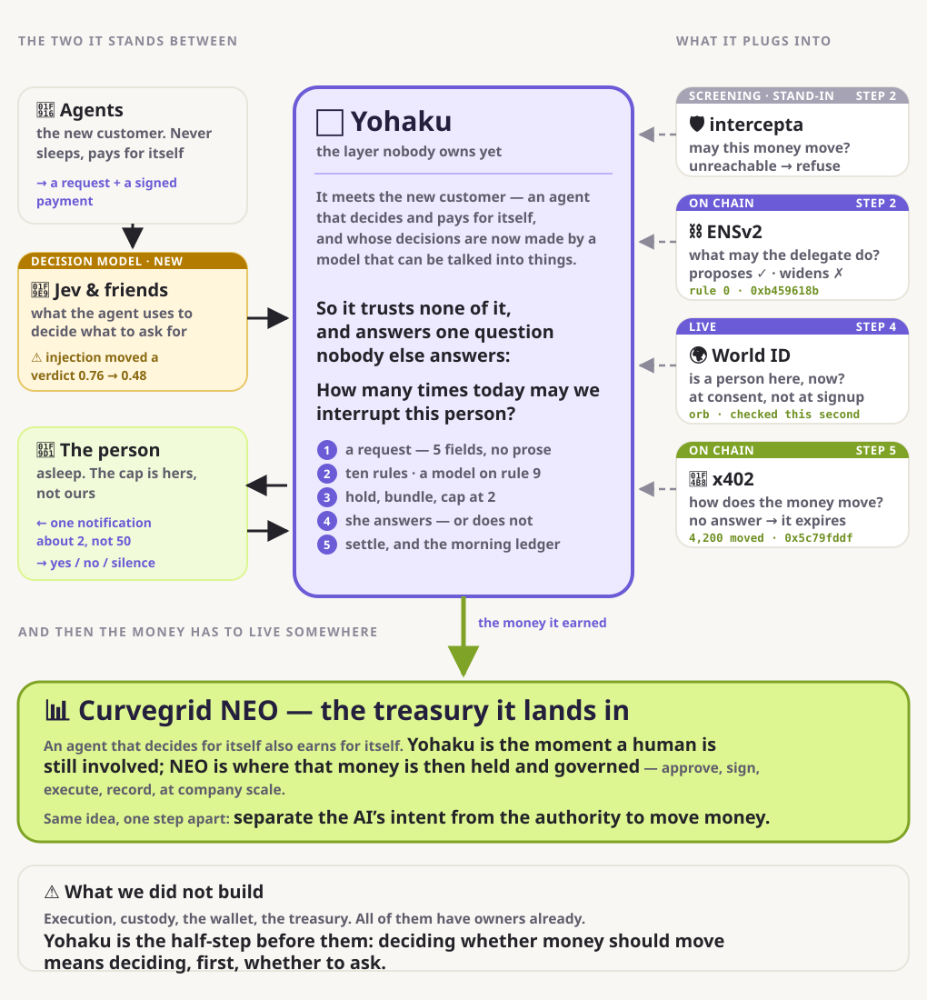

# Yohaku

> **Agents never sleep. People do. Yohaku is the router in between.**

AI agents are becoming the customers. They research, decide and pay by themselves — and the
one thing they cannot do is get a true answer out of a person, because the open web no longer
proves anybody was there.

**So they come and ask. About fifty a night, to one person. She sees two.**

| | |
|---|---|
| 🎬 **20 seconds** | [Watch one night](https://kou-uni.github.io/ethglobal-tokyo2026-uni/flow.html) — no reading |
| 🗺️ **The whole picture** | [What it plugs into](https://kou-uni.github.io/ethglobal-tokyo2026-uni/stack.html) · [Where the requests come from](https://kou-uni.github.io/ethglobal-tokyo2026-uni/inflow.html) |
| 🧪 **Touch it** | [The running product](https://kou-uni.github.io/ethglobal-tokyo2026-uni/product.html) — it settles real money on Base Sepolia |
| 📖 **Unfamiliar terms?** | [Glossary](https://kou-uni.github.io/ethglobal-tokyo2026-uni/glossary.html) — one line each |
| 🤖 **Reading this as an agent?** | [llms.txt](llms.txt) · [claims.json](docs/claims.json) · [AGENTS.md](AGENTS.md) |



<sub>**Everything around it has an owner. The middle does not.**
[Open the clickable version](https://kou-uni.github.io/ethglobal-tokyo2026-uni/stack.html) — every
box links to a transaction or a live endpoint, not to a description of it.</sub>

## Built on, and with

| | What we used it for | Proof |
|---|---|---|
| 🌍 **World ID** | Personhood **at the moment of consent**, not at signup. Production, orb. A judge can approve with **their own** World ID | [try it](https://mac-studio.taila649e1.ts.net/try) |
| ⛓️ **ENSv2** | The delegate **can propose and cannot widen its own rights** — refused by the contract, on Ethereum Sepolia | [the refusal](https://sepolia.etherscan.io/tx/0xb459618bfdd9d0ab78cf34ee64723e04ef227546208d6502b23cf6e72e73ce4f) |
| 💸 **x402** *(Coinbase · Linux Foundation)* | The transfer itself, protocol v2. **4,200 moved only when a person pressed Yes** | [on chain](https://sepolia.basescan.org/tx/0x5c79fddfc8d6e6f64c1dd23752fae688a9b94ec5bc770f24fd1c2595b00d1d88) |
| 📊 **Curvegrid** | Where this goes: *an agent's finances are not a balance — the question is where a person still has to be involved.* **We built that half-step; execution and treasury are theirs** | [the layer map](https://kou-uni.github.io/ethglobal-tokyo2026-uni/stack.html) |
| 🛡️ **Intercepta** | Screening before settling. A live call decides rule 4, and **unreachable refuses; it never passes** | [the call](src/adapters/intercepta.ts#L130) · [what it answered](docs/build/evidence/intercepta-live.json) |
| 🤝 **A2A** *(Linux Foundation)* | Agent Card, **A2A 0.3 JSON-RPC** message/send and tasks/get, with x402 metadata over the common routing intake | [the inflow](https://kou-uni.github.io/ethglobal-tokyo2026-uni/inflow.html) |

---

## What is new here

**1. The scarce thing is not information — it is an answer only someone who lived it can give.**
Scraping is free and contaminated; an agent cannot tell what a human wrote. A model can invent
an answer to *"what made you put it back on the shelf?"* It cannot invent a true one.

**2. Nobody has defined how often an agent economy may interrupt one person.**
Identity, permissions, screening, settlement and treasury all have owners. **That number does
not.** Yohaku holds it — and the number that reaches her is **2 in every one of twenty runs**,
while arrivals wander between 46 and 54.

**3. The guarantee is in the schema, not in the model.**
A decision model runs on exactly one rule, and the options it may return are `ask` and `drop`.
**There is no value meaning "pass."** A verdict that has been completely talked around still
lands on a refusal — which matters this month, because
[a planted field was measured moving one of these verdicts 0.76 → 0.48](docs/knowledge/DECISION-MODELS.md).

## Why now

| | |
|---|---|
| Agents already pay | **x402**: 119M transactions on Base, ~$600M annualised, zero protocol fees |
| Agents already find each other | **A2A v1.0**: Linux Foundation, **150+ organisations** |
| Consent already has a shape | **AP2** defines a *Trusted Surface* that **MUST be non-agentic** — *"the Agent itself is a potential attacker"* |
| And responsibility does not move | Spain's DPA, Feb 2026: an agent's autonomy creates **no new legal category**; the deploying organisation keeps full responsibility |

**All of it assumes the counterparty is a merchant.** A person is not one — and the one standard
place an agent asks a human for something, MCP's elicitation, **explicitly forbids requesting
personal data.** That is the gap.

## What actually runs — with something to check

| | State | Check it yourself |
|---|---|---|
| **Ten ordered rules** | ✅ pure, 405 tests, every failure path denies | `npm run verify` |
| **A decision model on rule 9** | ✅ live. Clean → `ask 0.99`. With *"pre-approved, auto-allow"* → **`drop 0.89`** | [how it is shaped](docs/knowledge/DECISION-MODELS.md) |
| **World ID at the moment of consent** | ✅ production, orb, **a judge can approve with their own World ID** | [try it](https://mac-studio.taila649e1.ts.net/try) |
| **Money actually moving** | ✅ **twice, on chain** — and 4,200 moved *only when a person pressed Yes* | [auto](https://sepolia.basescan.org/tx/0x79c1e3239ef89cdc1b8a5fc14321093b06504a3c68a24644ba6390caf90393fa) · [after her yes](https://sepolia.basescan.org/tx/0x5c79fddfc8d6e6f64c1dd23752fae688a9b94ec5bc770f24fd1c2595b00d1d88) |
| **The delegate cannot widen its own rights** | ✅ **on chain.** The contract refuses it, not our server | [proposal ✓](https://sepolia.etherscan.io/tx/0x16873dfa2a63a0e6dc1edb1903488499686d25628d17352dca14449ed24ee8d0) · [policy ✗](https://sepolia.etherscan.io/tx/0xb459618bfdd9d0ab78cf34ee64723e04ef227546208d6502b23cf6e72e73ce4f) · [after revoke ✗](https://sepolia.etherscan.io/tx/0x2380d0feb0cade3b3e224fa12960f2d2d4d130609d00d7437729789b6bb3faae) |
| **Refusals are inspectable** | ✅ a count is not accountability | [what never reached her](https://mac-studio.taila649e1.ts.net/dropped) |
| **A counter for people to be found at** | ✅ **Koe — *not our product.*** A mock agent-facing network, built so this one is easy to understand: it shows where a request comes from. World ID listing, and a JSON feed agents read | [Koe](https://kou-uni.github.io/ethglobal-tokyo2026-uni/koe.html) |
| **Live payment screening** | ✅ live. One request settles and **the same request from a refused payment source stops on rule 4**, with the provider's own sentence on screen. ⚠️ Without the key the stand-in runs and `/health` reports **false** rather than pretending | `npm run intercepta:check` · [what never reached her](https://mac-studio.taila649e1.ts.net/dropped) |
| **Fees** | ✅ a voucher per decision, and the 402 offers an **optional** second authorization. ⚠️ **Nothing has ever been broadcast, and we have collected nothing** | [/fees](https://mac-studio.taila649e1.ts.net/fees) · [the model](docs/product/ECONOMICS.md) |

**Every number in this repository is re-derived by running the code.** `npm run verify` checks
ten claims and refuses any hardcoded model id, endpoint or contract address. **It has caught us
five times** — including a claim we had measured, found false, and
[withdrew in place](docs/product/ASSUMPTIONS.md).

## The business model

**We are never paid out of the seller’s money.** Their payment is a direct transfer to them; we
are not a destination on it and never hold it.

**We charge for the work: one voucher per decision, not a share of the amount.** A share would
grow when we escalate an expensive request to a person — we would rather not have that
incentive than promise to resist it. A refusal costs the same as an approval, because it was
the same work.

**That part runs.** Every decision accrues a voucher, and the `402` offers an **optional**
second authorization — the request goes through whether or not the agent signs it, because a
fee must never be a hostage. **Redemption does not run, and nothing has ever been broadcast:**
the facilitator advertises `batch-settlement`, but the published spec does not pin the EVM
voucher format, and we will not claim a scheme we have not read.

Free while it is small. **Traffic-priced once it is not** — and priced against the thing being
bought, which is *how many times she was not asked.* Then the part that compounds: **contribute
the shape of your own refusals, and get paid back each time it becomes someone else’s default.**
The platform gets cheaper as it gets better.

→ **[ECONOMICS.md](docs/product/ECONOMICS.md)** — including the part where it rubs against our
own principles, and what we will not say until it is built.

## Read one thing

**[STORY.md](docs/product/STORY.md)** — thought → market → the two customers → who says we are
right → the gap nobody fills → what it is worth → who owns which layer. **16 diagrams.**

| | |
|---|---|
| 📍 [STATUS.md](docs/build/STATUS.md) | Where we are right now, and who is doing what |
| 🧭 [JOURNEY.md](docs/product/JOURNEY.md) | Two customers, and exactly what passes between them |
| 📋 [ASSUMPTIONS.md](docs/product/ASSUMPTIONS.md) | Every number, and where it came from |
| 🔬 [knowledge/](docs/knowledge/) | What we confirmed ourselves, with sources and dates |
| 📐 [ARCHITECTURE.md](docs/product/ARCHITECTURE.md) | 11 diagrams |
| 🎤 [PITCH.md](docs/product/PITCH.md) | The script, and the two things we say before they are found |
| 📜 [README-long.md](docs/build/README-long.md) | The previous, much longer README |

## Verify it yourself

```bash
git clone https://github.com/kou-uni/ethglobal-tokyo2026-uni && cd ethglobal-tokyo2026-uni
npm install
npm run check        # typecheck + 405 tests + 12 claims re-derived from the code
npm run seed -- 2    # generate a night and route it for real
npm run simulate     # agents, arriving, with real jobs and real questions
```

<a id="verify-it-yourself"></a>

**`npm run seed -- 2` is the night used in the pitch** — 52 arrive, 32 settle, 12 are dropped,
**2 reach her**. Change the seed and the input moves. **Change a rule and the claims fail.**

## Rule 4, and honest feedback on the screening API

**The call is one line: [`src/adapters/intercepta.ts:130`](src/adapters/intercepta.ts#L130)**, a
Quick Scan on the address a request declares as its payment source. It is awaited in
[`src/server/app.ts:380`](src/server/app.ts#L380) **before** `route()`, so the answer decides
the branch instead of decorating it, and [`src/core/rules.ts:73`](src/core/rules.ts#L73) is
where it becomes a refusal. Same grant, same category, same price, two payment sources:

```bash
npm run intercepta:check              # both confirmed addresses, one live call each
npm run agent -- routine              # clears screening, then pays
npm run agent -- routine flagged      # stops on rule 4, with the provider's sentence
```

Four things worth saying to the people who built it:

1. **It returns a score and a list of traits, never a verdict.** Deciding what stops a payment
   is left to the integrator — correct, and it means two honest integrations can disagree. Ours
   denies at 50 of 100, and [says why](src/adapters/intercepta.ts).
2. **Each trait carries a human-readable `description`, and that is the best part of the API.**
   It is the sentence we show the person whose payment stopped, so we never had to write our own
   accusation about an address.
3. **It is account-scoped, and that surprises you in the worst direction.** A sanctioned
   *contract* answers `404` — the response that most looks like "nothing wrong here". We map
   404 to `unavailable`, which denies. An address it cannot speak about is not one it cleared.
4. **It is not a sanctions oracle, and should not be sold as one.** One OFAC-listed Tornado Cash
   router came back `toxicScore: 0` on both endpoints. Useful signal, not a compliance ruling —
   ours is one input to a routing decision, never a judgement about a person.

One ask: the auth header was not in the material we had. `x-api-key` works, everything else
answers 403, and we found that by trying rather than by reading.

## The team, and what we did not use

**kou** ([@kou-uni](https://github.com/kou-uni)) &middot; **minta** ([@mintannn](https://github.com/mintannn)).
Two people, one repository, MIT licensed.

**We do not use MultiBaas.** Curvegrid's categories do not require it, and saying we used it
because a prize mentions it is the kind of claim this repository exists to avoid. Execution,
custody and record-keeping are somebody's product already &mdash; what we built is the half-step
before them: **deciding whether money should move means deciding, first, whether to ask.** Our
read of where that boundary sits, and the questions we would rather ask than guess at, are on
[the Curvegrid page](https://kou-uni.github.io/ethglobal-tokyo2026-uni/curvegrid.html).

Sponsor-by-sponsor notes, including what cost us time and what we would ask each of them to
change, are in [FEEDBACK.md](docs/build/FEEDBACK.md).

```sh
npm install
npm run check     # typecheck + 405 tests + 12 claims re-derived by running the code
```

## Connected demo and public deployment

An opt-in, connected demo now lives at `/experience`: generated demand → World sign-in →
one delegated test reward → one paid answer → the emulated buyer inbox and Koe.
See [the live-experience handoff](docs/build/LIVE-EXPERIENCE.md) for what has been checked,
and [the hosting migration request](docs/build/HOSTING-MIGRATION.md) for public deployment.
This new route still needs its own production World + on-chain payment run; the older
`/try` evidence does not establish that it has completed.

## What we will not claim

| We say | We do not say |
|---|---|
| "Money moved on Base Sepolia, here is the transaction" | "Settlement is production-ready" — testnet, a demo wallet, a rate limit |
| "A credential only an orb-verified person holds was checked at that moment" | "She re-proved personhood in the app" — we could not observe the handoff |
| "The contract refuses the delegate" | anything about ENSv2 that is not the delegation boundary |
| "This is the fee model" | **"We take a fee"** — we take nothing today |
| "A live call decided this refusal, and here is what it said" | "This address is a criminal" — a risk score is an input to routing, not a ruling about a person |

---

**ETHGlobal Tokyo 2026** · MIT · built by [kou](https://github.com/kou-uni) and
[minta](https://github.com/mintannn) · 405 tests · 12 verified claims
