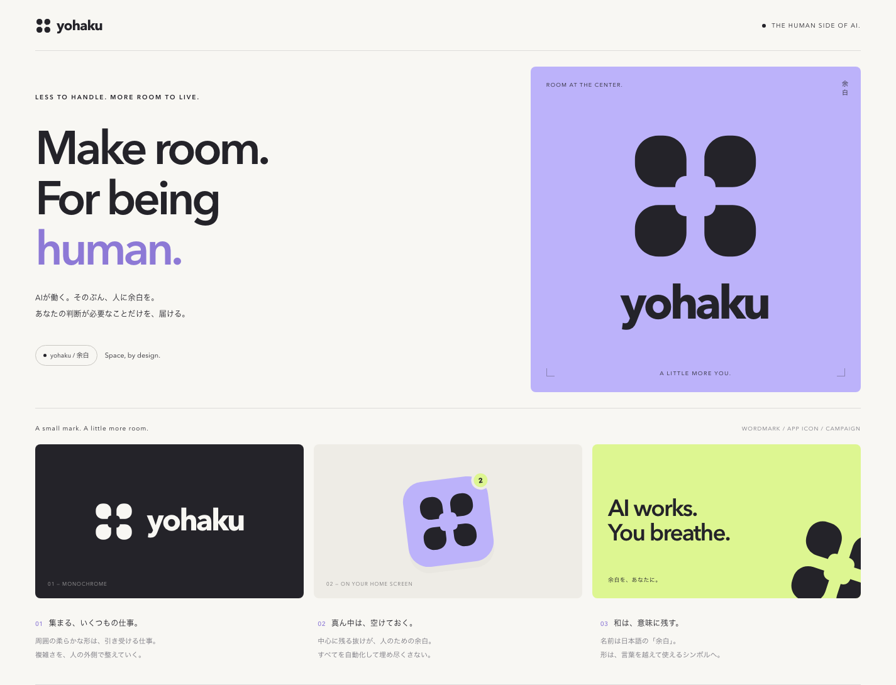

# yohaku — Selected identity v3

採用案：v3。

## 方向

海外のAIスタートアップを意識した、抽象シンボル＋小文字の英字ロゴ。前案の茶器・顔・和カフェの意匠から離れ、日本らしさは「余白」という名前と意味に残す。

**Make room. For being human.**

AIが働く。そのぶん、人に余白を。

## シンボルの物語

仕事を表す柔らかな形が、中央を埋めずに周囲へ整う。その中央の抜けが、人のために残した時間・判断の余地を表す。

四つの形をauto／human／denyへ無理に対応させない。機能図ではなく、仕事が整った後の体験を表すブランド記号。

可愛さは顔やキャラクターではなく、丸み・低い重心・配色に持たせる。

## アセット

- [mark.svg](mark.svg)：暗色シンボル。パスのみで、フォント非依存
- [mark-light.svg](mark-light.svg)：白色シンボル
- [lockup.svg](lockup.svg)：英字ロゴ付き。文字は未アウトラインのため環境のフォントに依存
- [index.html](index.html)：PC・モバイル対応のブランドボード、使用例、約6秒のアニメーション。ローカルで開いて閲覧
- [preview.png](preview.png)：デスクトッププレビュー
- [mobile.png](mobile.png)：モバイルプレビュー

色：Ink `#242329` ／ Paper `#F8F7F3` ／ Lilac `#BCB2FA` ／ Lime `#DDF691`。

SVGとHTML/CSSで制作。外部フォント・ライブラリ・画像生成APIは不使用。ブランド演出と画面内の通知は試作であり、実装や実績を意味しない。

## 参照した公開サイト

方向検討時に公式サイトの見出し・配色・表現を確認した。既存ロゴや固有の図形は流用していない。

- Granola： https://www.granola.ai
- Linear： https://linear.app

これらを「全海外スタートアップの最新トレンド」の根拠とはしない。本案はユーザーの希望に対するデザイン提案。

製品への適用時には、書体のアウトラインと最小表示サイズを詰める。
