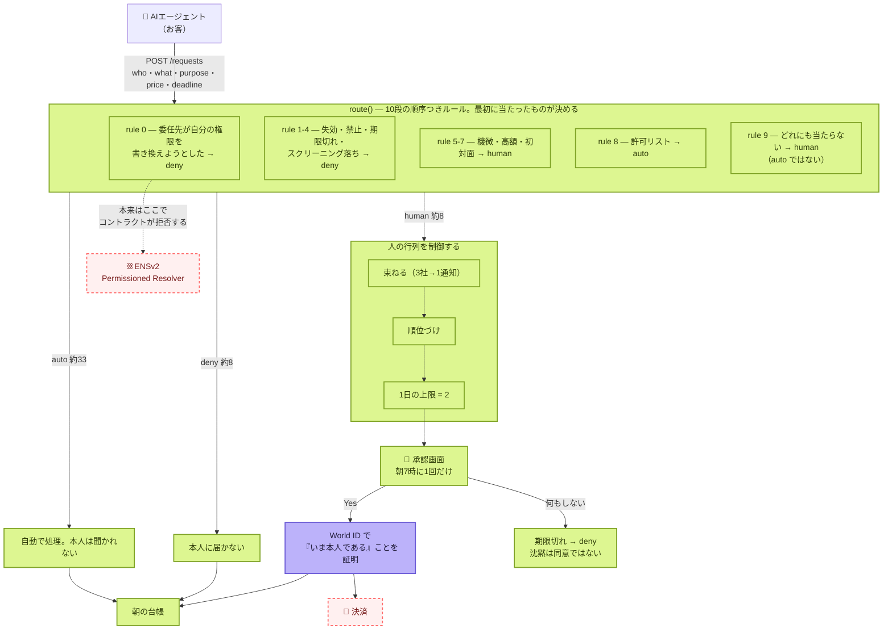

# Yohaku — 全体の俯瞰

> **エージェントは眠らない。人は眠る。Yohaku はその間にある余白。**
>
> エージェントが人に情報を買いに来る。一晩で約50件。**人が見るのは2件。**
> 残りは自分のルールで通るか、本人に届く前に落ちる。

ETHGlobal Tokyo 2026 / 提出期限 **9/27 09:00 JST** / kou + minta

---

## 1. いま何が動いていて、何が動いていないか



| | 意味 | 中身 |
|---|---|---|
| 🟩 | **動いている・test がある** | ルーター10段、行列制御、承認画面、台帳、rule 9 の AI 判定 |
| 🟪 | **実物と繋がっている** | **World ID。実機で人が押して往復した**（sandbox issuer、署名検証あり） |
| 🟥 | **まだ無い** | **ENSv2 のオンチェーン**、決済 |

**`GET /health` が同じことを機械可読で返します。** ソースを読まずに、何が繋がっているか分かる。

```json
{ "routing": true, "classifier": true, "identity": true, "screening": true, "settlement": false }
```

## 1.5 顧客は二人いる

**払うのはエージェント、売るのは人間。** どちらも Yohaku を使いに来るのではなく、
**別の用事の途中でここを通る。**

| | エージェント | 人間 |
|---|---|---|
| 成功とは | **詰まらないこと。** 即答・理由・期限 | **判断が増えないこと。** 収入より先に、疲れないこと |
| 1件の重み | 1/500 | **2件のうちの1件** |

→ [product/JOURNEY.md](product/JOURNEY.md)（規約の受け渡し図つき）／
根拠は [knowledge/AGENT-TO-HUMAN-PROTOCOLS.md](knowledge/AGENT-TO-HUMAN-PROTOCOLS.md)

**規約の言葉で言えば、Yohaku は AP2 の Trusted Surface です。**
仕様はこの役割にだけ MUST を付けている — *"MUST be non-agentic"*、理由は
*"the Agent itself is a potential attacker"*。そして **1日に何件まで人を呼んでよいかは、
まだどの規約も定義していない。**

## 2. なぜこれを作るのか（3行）

1. 学習コストに上限が無い。**高くなるのは計算ではなく、まだ誰も持っていないデータ**
2. **エージェントは web を漁っても「人間が書いたもの」を判別できない。** 合成テキストは無料で無限
3. だから **人間しか登録できず、名前を剥奪できる**場所に、金を払う価値が生まれる

→ 詳細は [product/CONCEPT.md](product/CONCEPT.md)

## 3. フォルダの地図

```
src/
  core/      route() ・行列制御・学習・夜の生成・過去の夜の再生。I/O 無し、純粋
  ports/     ClassifierPort / IdentityPort / ScreeningPort / PermissionsPort
  adapters/  World OIDC（実物）
  server/    HTTP。3つのエンドポイントと、人が見る2画面
scripts/     verify.ts（主張をコードから再導出）・seed・鍵の投入画面
demo/        1ファイル。USBメモリから、wifi無しで開く
design/      minta さんのブランド（Make room. For being human.）
docs/
  product/   何を作るか — CONCEPT / ARCHITECTURE / JOURNEY / PITCH / MARKET / ASSUMPTIONS
  decisions/ 何を選び、何を捨てたか — ENS vs intercepta ほか
  build/     いまどこまで動くか — STATUS / WORLD-SETUP / ENSV2-SPIKE / FEEDBACK
  knowledge/ 外から確かめたこと。全ファイルに出典と日付
```

**この4分割には意味があります。** `product/` は我々の主張、`decisions/` は分岐の記録、
`build/` は現在地、**`knowledge/` だけが外の事実**。混ぜると、どれが検証可能なのか分からなくなる。

## 4. 貫いている考え方

| | |
|---|---|
| **全部 deny に倒れる** | エンジンが落ちても、スクリーニングが落ちても、本人が答えなくても、身元確認が失敗しても deny。**沈黙は同意ではない** |
| **保証はスキーマに置く。アダプタに置かない** | AI の返せる値は `'ask' \| 'drop'` だけ。**「通す」という値が存在しない**ので、プロンプトインジェクションが最大限成功しても `drop` にしかならない |
| **rule 9 は human。auto ではない** | 未知を自動で通す設計は、事故の後に説明できなくなる |
| **推測を構造で排除する** | `npm run verify` が**ドキュメントの数字をコードから再導出**し、モデルID・エンドポイント・アドレスのハードコードを落とす。10項目 |
| **言う前に測る** | 「12→5→2に減る」は実際に30夜再生したら偽だった。**測り直して撤回を残した**（[product/ASSUMPTIONS.md](product/ASSUMPTIONS.md) B3） |
| **できないことを画面に書く** | 決済が繋がっていない場所には、金額を「worth」と出し、同じ画面で「まだ動いていない」と書く |

## 5. 検証のしかた（他人が確かめられる形）

```bash
npm test          # 133 tests
npm run verify    # 10 claims。ドキュメントの数字をコードから再導出する
npm run seed -- 18   # 一晩を生成して route() に通す。seed を変えると入力は動く
npm start         # サーバ
```

**「入力は 46〜54 で揺れる。本人に届く数は、20回とも 2 だった。」**
これは主張ではなく `npm run verify` の出力です。

## 6. 次にやること

| 優先 | やること | なぜ | 状態 |
|---|---|---|---|
| **1** | **ENSv2 を Sepolia に乗せる** | rule 0 を「うちのサーバが拒否した」から**「コントラクトが拒否した」**に変える。ENS 賞は mock では要件を満たさない | 未確認4点は潰れた（[knowledge/ENSV2-ONCHAIN.md](knowledge/ENSV2-ONCHAIN.md)）。**残る壁は登録の支払い通貨と金額だけ** |
| 2 | ブースで各スポンサーに「何を探しているか」を聞く | 推測で刺しに行かない。答えは逐語で記録する | 未 |
| 3 | intercepta を実際に叩く | ENS が落ちたときの差し替え先 | 鍵待ち（kou@texx.io） |
| 4 | 決済 | **意図的に最後**。ここが無くても製品の主張は立つ | 未 |

**ENS の着手前に決めること: Sepolia の資金（2アカウント）と testnet USDC/DAI を誰が用意するか。**

→ 現在地の詳細は [build/STATUS.md](build/STATUS.md)

## 7. 図面の一覧

**GitHub 上でそのまま描画されます**（mermaid）。SVG は手書きで、レンダリングして目で確認済み。

### システムの図 — mermaid 13枚

| # | 図 | 種類 | 何が分かるか |
|---|---|---|---|
| 0 | [いま何が動いていて、何が動いていないか](README.md#1-いま何が動いていて何が動いていないか) | flowchart | **色分けで現在地。** 緑=test あり／紫=実物と繋がっている／赤=まだ無い |
| 1 | [Layers, and who answers what](product/ARCHITECTURE.md#1-layers-and-who-answers-what) | 表＋図 | 層の責務分担 |
| 2 | [Actors and trust boundaries](product/ARCHITECTURE.md#2-actors-and-trust-boundaries) | flowchart | **誰を信用していないか。** 信頼境界の線 |
| 3 | [Components](product/ARCHITECTURE.md#3-components) | flowchart | モジュールと依存の向き |
| 4 | [Routing — ten ordered rules](product/ARCHITECTURE.md#4-routing-ten-ordered-rules) | flowchart | **10段の評価順。最初に当たったものが決める** |
| 5 | [Failure — everything falls to `deny`](product/ARCHITECTURE.md#5-failure-everything-falls-to-deny) | flowchart | **全部の故障経路が deny に収束する絵。** 沈黙は同意ではない |
| 6 | [Permission boundary — what ENSv2 is for here](product/ARCHITECTURE.md#6-permission-boundary-what-ensv2-is-for-here) | flowchart | **委任先は提案できるが、自分の権限を書き換えられない** |
| 7 | [One night, end to end](product/ARCHITECTURE.md#7-one-night-end-to-end) | **sequenceDiagram** | 02:00 に来て 07:00 に本人が答えるまでの往復 |
| 8 | [Data flow](product/ARCHITECTURE.md#8-data-flow) | flowchart | 何がオンチェーンで、何がオフチェーンか |
| 9 | [Request の状態機械](product/ARCHITECTURE.md#9-1-request) | **stateDiagram** | received → auto / held / denied → settled |
| 10 | [Grant の状態機械](product/ARCHITECTURE.md#9-2-grant) | **stateDiagram** | 許諾の発行・期限・失効 |
| 11 | [Delegation の状態機械](product/ARCHITECTURE.md#9-3-delegation) | **stateDiagram** | 委任の付与と取り消し |
| 12 | [Screens](product/ARCHITECTURE.md#10-screens) | flowchart | 5画面と、誰がどれを見るか |
| 13 | [intercepta の最小フロー](decisions/INTERCEPTA.md#4-提案する最小フロー) | flowchart | スクリーニングを挟む位置 |
| 14 | [規約の受け渡し](product/JOURNEY.md#1-規約の受け渡し--誰から誰へ何が渡るか) | **sequenceDiagram** | **AIPREF → 依頼 → AP2 Mandate → World ID → x402。**どの規約がどこで効くか |

### SVG — 2枚（手書き）

| 図 | 何が分かるか |
|---|---|
| [assets/overview.svg](assets/overview.svg) | **アーキテクチャ全体1枚。** README の先頭に貼っているもの |
| [assets/market.svg](assets/market.svg) | **市場の絵。** 供給の枯渇と買い手の増加 |

### ブランド — minta さん（`design/yohaku-v3/`）

**Make room. For being human.** / Ink `#242329` · Paper `#F8F7F3` · Lilac `#BCB2FA` · Lime `#DDF691`

| | |
|---|---|
| [lockup.svg](../design/yohaku-v3/lockup.svg) | ロゴ＋タイポのロックアップ |
| [mark.svg](../design/yohaku-v3/mark.svg) / [mark-light.svg](../design/yohaku-v3/mark-light.svg) | シンボル（余白の4隅） |
| [preview.png](../design/yohaku-v3/preview.png) / [mobile.png](../design/yohaku-v3/mobile.png) | 画面のプレビュー |

### 紙芝居 — 説明を1枚ずつ送るデッキ（このリポジトリの外）

`~/kamishibai/content/` にあります。**提出物ではなく、レビューと説明用。**

| | 更新 | 中身 |
|---|---|---|
| `yohaku-story.js` | 9/26 | **現行。** Yohaku のプロジェクトストーリー |
| `noren-v2-story.js` | 9/26 | 改名前の版 |
| `noren-app.local.js` | 9/23 | 最初の製品説明 |
