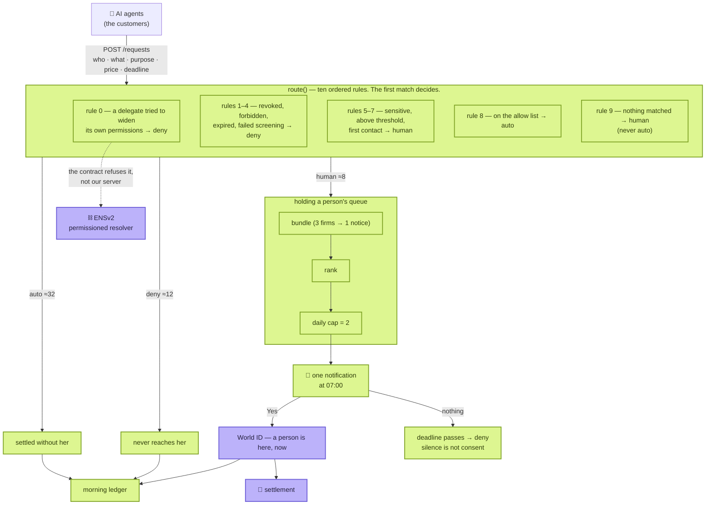

# Yohaku — the whole thing on one page

> **Agents never sleep. People do. Yohaku is the space in between.**
>
> Agents come to buy information from a person. About fifty a night. **She sees two.**
> The rest pass under her own rules, or never reach her at all.

ETHGlobal Tokyo 2026 · submission deadline **27 Sep, 09:00 JST** · kou + minta

---

## 1. What runs, and what does not



| | Meaning | What it covers |
|---|---|---|
| 🟩 | **Running, with tests** | Ten rules, queue control, the morning ledger, the drop list, a decision model on rule 9 |
| 🟪 | **Connected to the real thing** | **World ID** (production, orb), **x402** (money moved on chain), **ENSv2** (the contract refuses the delegate) |
| 🟥 | Still a stand-in | Live payment screening. `/health` reports it **false** rather than pretending |

**`GET /health` says the same thing in machine-readable form**, so nobody has to read the source
to find out what is wired.

## 1.4 Read one thing

**[product/STORY.md](product/STORY.md)** — thought → market → the two customers → who says we are
right → the gap nobody fills → what it is worth → who owns which layer. **Sixteen diagrams**,
and the pictures carry it.

## 1.5 There are two customers

**The agent pays. The person sells.** Neither of them comes here on purpose — both pass through
on the way to something else.

| | The agent | The person |
|---|---|---|
| Success is | **not stalling** — an answer, a reason, a deadline | **not deciding more often.** Before income: not being worn out |
| One request weighs | 1 in 500 | **1 of 2** |

→ [product/JOURNEY.md](product/JOURNEY.md), with the handoffs. Grounded in
[knowledge/AGENT-TO-HUMAN-PROTOCOLS.md](knowledge/AGENT-TO-HUMAN-PROTOCOLS.md).

**In the language of AP2, Yohaku is a Trusted Surface.** The specification puts a MUST on that
one role — *"MUST be non-agentic"* — because *"the Agent itself is a potential attacker."*
And **how many times a day an agent economy may interrupt one person is still undefined by
anyone.**

## 2. Why anyone pays a person at all

1. Training costs have no ceiling. **What gets expensive is not compute — it is data nobody has**
2. **An agent cannot tell what a human wrote.** Synthetic text is free and endless
3. So **scraping is free and contaminated**, and a provable human answer is the scarce thing

→ [product/CONCEPT.md](product/CONCEPT.md)

## 3. The map of the repository

```
src/
  core/      route(), queue control, learning, the night generator, the replay. Pure, no I/O
  ports/     ClassifierPort · IdentityPort · ScreeningPort · PermissionsPort · SettlementPort
  adapters/  World OIDC, World IDKit, x402, ENSv2, the decision model
  server/    node:http. The endpoints, and the two screens a person sees
scripts/     verify.ts (re-derives the claims) · seed · simulate · the credential pages
demo/        one file. Opens from a USB stick with no network
docs/
  product/   what we are building — STORY · CONCEPT · ARCHITECTURE · JOURNEY · ECONOMICS · PITCH
  decisions/ what we chose, and what we discarded
  build/     where we are — STATUS · setup guides · FEEDBACK
  knowledge/ what we confirmed from the outside. Every file carries its sources and a date
```

**The four folders mean something.** `product/` is our claim, `decisions/` is the record of a
fork, `build/` is where we stand, **and only `knowledge/` is outside fact.** Mixing them makes it
impossible to tell what can be checked.

## 4. What runs through all of it

| | |
|---|---|
| **Everything falls to deny** | Engine down, screening unreachable, identity failed, no answer before the deadline — all of them refuse. **Silence is not consent** |
| **The guarantee lives in the schema** | The model may answer `ask` or `drop`. **There is no value meaning "pass"**, so a prompt injection that fully succeeds still only reaches a refusal |
| **Rule 9 goes to a human, not to auto** | A system that auto-approves the unknown cannot be explained after an incident |
| **Guessing is refused structurally** | `npm run verify` re-derives the documented numbers from the code and rejects any hardcoded model id, endpoint or address. Ten claims |
| **Measure before saying** | "12 → 5 → 2 in a week" was false. Thirty nights were replayed, and **the retraction is still visible** ([ASSUMPTIONS](product/ASSUMPTIONS.md) B3) |
| **Say what it cannot do** | Where settlement is not wired, the screen says so on the same page as the amount |

## 5. Checking it instead of trusting it

```bash
npm test             # 343 tests
npm run verify       # 12 claims, re-derived by running the code
npm run seed -- 2    # generate a night and route it for real
npm run simulate     # agents arriving, with real jobs and real questions
npm start            # the server
```

**"Arrivals wander between 46 and 54. What reaches her was 2 in all twenty runs."**
That is the output of `npm run verify`, not a claim. **Disprove it with the same command.**

## 6. What is left

| | | |
|---|---|---|
| 1 | **Record the video, and file the submission** | The evidence is in place; the words are drafted |
| 2 | **Ask each sponsor what they are looking for** | Not whether they like it. Verbatim |
| 3 | **Fees** | [Designed](product/ECONOMICS.md), and **taking nothing today** |

→ [build/STATUS.md](build/STATUS.md) for where we actually are.

## 7. The diagrams

**Everything renders on GitHub.** The SVGs were drawn by hand and checked by eye.

### The live pages

| | |
|---|---|
| [One night, animated](https://kou-uni.github.io/ethglobal-tokyo2026-uni/flow.html) | Twenty seconds, no reading |
| [What it plugs into](https://kou-uni.github.io/ethglobal-tokyo2026-uni/stack.html) | Every box links to a transaction or a live endpoint |
| [Where the requests come from](https://kou-uni.github.io/ethglobal-tokyo2026-uni/inflow.html) | Discovery, the call and the payment, on standards we did not invent |
| [The running product](https://kou-uni.github.io/ethglobal-tokyo2026-uni/product.html) | Live status, and an honest list of what is not wired |
| [The business model](https://kou-uni.github.io/ethglobal-tokyo2026-uni/business.html) | Never paid out of the seller's money |
| [Glossary](https://kou-uni.github.io/ethglobal-tokyo2026-uni/glossary.html) | One line per term |

### In the documents

| # | Diagram | Kind | What it shows |
|---|---|---|---|
| 1 | [Layers](product/ARCHITECTURE.md#1-layers-and-who-answers-what) | table | Who answers what |
| 2 | [Actors and trust boundaries](product/ARCHITECTURE.md#2-actors-and-trust-boundaries) | flowchart | **Who is not trusted** |
| 3 | [Components](product/ARCHITECTURE.md#3-components) | flowchart | Modules, and which way they depend |
| 4 | [Ten ordered rules](product/ARCHITECTURE.md#4-routing-ten-ordered-rules) | flowchart | **First match decides** |
| 5 | [Failure](product/ARCHITECTURE.md#5-failure-everything-falls-to-deny) | flowchart | **Every path converging on `deny`** |
| 6 | [Permission boundary](product/ARCHITECTURE.md#6-permission-boundary-what-ensv2-is-for-here) | flowchart | The delegate cannot widen its rights |
| 7 | [One night](product/ARCHITECTURE.md#7-one-night-end-to-end) | **sequence** | 02:00 to settlement |
| 8 | [Data flow](product/ARCHITECTURE.md#8-data-flow) | flowchart | On chain, and off it |
| 9–11 | [Request](product/ARCHITECTURE.md#9-1-request) · [Grant](product/ARCHITECTURE.md#9-2-grant) · [Delegation](product/ARCHITECTURE.md#9-3-delegation) | **state** | Lifecycles |
| 12 | [Screens](product/ARCHITECTURE.md#10-screens) | flowchart | Who sees which |
| 13 | [Handoffs](product/JOURNEY.md#1-規約の受け渡し--誰から誰へ何が渡るか) | **sequence** | **What passes at each step** |
| 14 | [The story](product/STORY.md) | 16 diagrams | Thought → market → journey → the gap → value → layers |
| 15 | [Money, in one look](business.html) | **SVG** | **The requests go through us, the money goes around us.** Price and fee drawn to scale |
| 16 | [Cash flow, with the mechanism](assets/cashflow.svg) | **SVG** | Two lanes: the price, and the optional per-decision fee. Linked, not on the page |
| 17 | [The value loop](business.html) | **SVG** | What accumulates per person, what only a platform sees, and what is **not built** |

### Brand — minta (`design/yohaku-v3/`)

**Make room. For being human.** · Ink `#242329` · Paper `#F8F7F3` · Lilac `#BCB2FA` · Lime `#DDF691`
