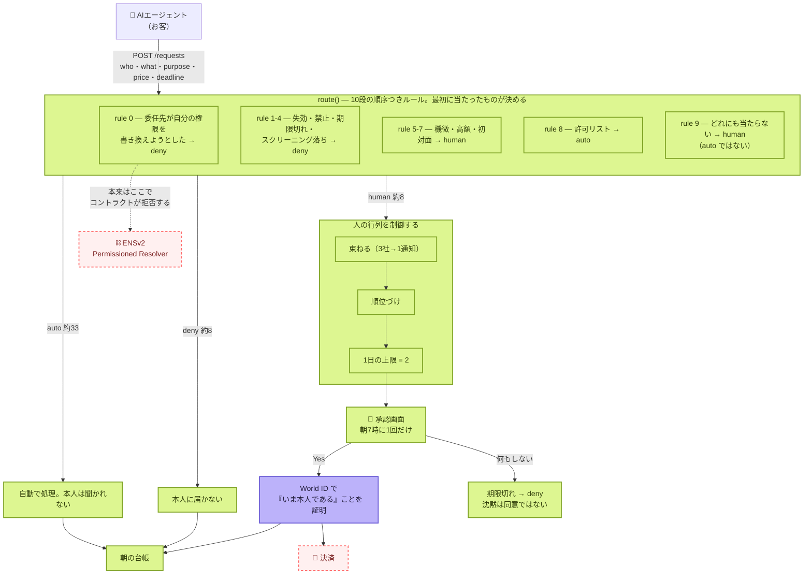

# Yohaku — 全体の俯瞰

> **エージェントは眠らない。人は眠る。Yohaku はその間にある余白。**
>
> エージェントが人に情報を買いに来る。一晩で約50件。**人が見るのは2件。**
> 残りは自分のルールで通るか、本人に届く前に落ちる。

ETHGlobal Tokyo 2026 / 提出期限 **9/27 09:00 JST** / kou + minta

---

## 1. いま何が動いていて、何が動いていないか



| | 意味 | 中身 |
|---|---|---|
| 🟩 | **動いている・test がある** | ルーター10段、行列制御、承認画面、台帳、rule 9 の AI 判定 |
| 🟪 | **実物と繋がっている** | **World ID。実機で人が押して往復した**（sandbox issuer、署名検証あり） |
| 🟥 | **まだ無い** | **ENSv2 のオンチェーン**、決済 |

**`GET /health` が同じことを機械可読で返します。** ソースを読まずに、何が繋がっているか分かる。

```json
{ "routing": true, "classifier": true, "identity": true, "screening": true, "settlement": false }
```

## 2. なぜこれを作るのか（3行）

1. 学習コストに上限が無い。**高くなるのは計算ではなく、まだ誰も持っていないデータ**
2. **エージェントは web を漁っても「人間が書いたもの」を判別できない。** 合成テキストは無料で無限
3. だから **人間しか登録できず、名前を剥奪できる**場所に、金を払う価値が生まれる

→ 詳細は [product/CONCEPT.md](product/CONCEPT.md)

## 3. フォルダの地図

```
src/
  core/      route() ・行列制御・学習・夜の生成・過去の夜の再生。I/O 無し、純粋
  ports/     ClassifierPort / IdentityPort / ScreeningPort / PermissionsPort
  adapters/  World OIDC（実物）
  server/    HTTP。3つのエンドポイントと、人が見る2画面
scripts/     verify.ts（主張をコードから再導出）・seed・鍵の投入画面
demo/        1ファイル。USBメモリから、wifi無しで開く
design/      minta さんのブランド（Make room. For being human.）
docs/
  product/   何を作るか — CONCEPT / ARCHITECTURE / PITCH / MARKET / ASSUMPTIONS
  decisions/ 何を選び、何を捨てたか — ENS vs intercepta ほか
  build/     いまどこまで動くか — STATUS / WORLD-SETUP / ENSV2-SPIKE / FEEDBACK
  knowledge/ 外から確かめたこと。全ファイルに出典と日付
```

**この4分割には意味があります。** `product/` は我々の主張、`decisions/` は分岐の記録、
`build/` は現在地、**`knowledge/` だけが外の事実**。混ぜると、どれが検証可能なのか分からなくなる。

## 4. 貫いている考え方

| | |
|---|---|
| **全部 deny に倒れる** | エンジンが落ちても、スクリーニングが落ちても、本人が答えなくても、身元確認が失敗しても deny。**沈黙は同意ではない** |
| **保証はスキーマに置く。アダプタに置かない** | AI の返せる値は `'ask' \| 'drop'` だけ。**「通す」という値が存在しない**ので、プロンプトインジェクションが最大限成功しても `drop` にしかならない |
| **rule 9 は human。auto ではない** | 未知を自動で通す設計は、事故の後に説明できなくなる |
| **推測を構造で排除する** | `npm run verify` が**ドキュメントの数字をコードから再導出**し、モデルID・エンドポイント・アドレスのハードコードを落とす。10項目 |
| **言う前に測る** | 「12→5→2に減る」は実際に30夜再生したら偽だった。**測り直して撤回を残した**（[product/ASSUMPTIONS.md](product/ASSUMPTIONS.md) B3） |
| **できないことを画面に書く** | 決済が繋がっていない場所には、金額を「worth」と出し、同じ画面で「まだ動いていない」と書く |

## 5. 検証のしかた（他人が確かめられる形）

```bash
npm test          # 133 tests
npm run verify    # 10 claims。ドキュメントの数字をコードから再導出する
npm run seed -- 18   # 一晩を生成して route() に通す。seed を変えると入力は動く
npm start         # サーバ
```

**「入力は 46〜54 で揺れる。本人に届く数は、20回とも 2 だった。」**
これは主張ではなく `npm run verify` の出力です。

## 6. 次にやること

| 優先 | やること | なぜ | 状態 |
|---|---|---|---|
| **1** | **ENSv2 を Sepolia に乗せる** | rule 0 を「うちのサーバが拒否した」から**「コントラクトが拒否した」**に変える。ENS 賞は mock では要件を満たさない | 未確認4点は潰れた（[knowledge/ENSV2-ONCHAIN.md](knowledge/ENSV2-ONCHAIN.md)）。**残る壁は登録の支払い通貨と金額だけ** |
| 2 | ブースで各スポンサーに「何を探しているか」を聞く | 推測で刺しに行かない。答えは逐語で記録する | 未 |
| 3 | intercepta を実際に叩く | ENS が落ちたときの差し替え先 | 鍵待ち（kou@texx.io） |
| 4 | 決済 | **意図的に最後**。ここが無くても製品の主張は立つ | 未 |

**ENS の着手前に決めること: Sepolia の資金（2アカウント）と testnet USDC/DAI を誰が用意するか。**

→ 現在地の詳細は [build/STATUS.md](build/STATUS.md)
