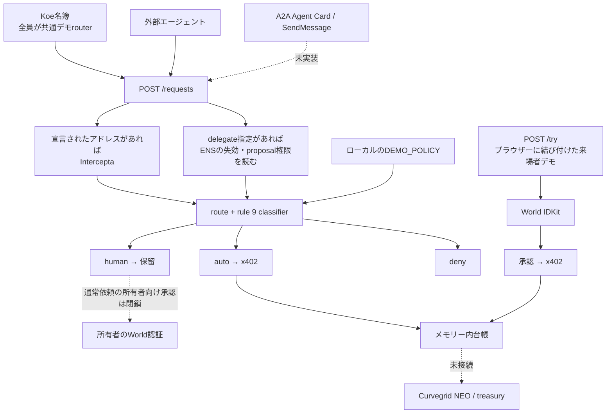

# 構成に沿った結合試験 — 2026-09-26

**後続の実機試験：** 公開接続が復旧し、本人による本番World承認からテスト送金まで
同一依頼で成功しました。[ウォークスルー結果](WORLD-WALKTHROUGH-2026-09-26.md)を参照してください。
以下はそれ以前に行った構成監査の記録です。再現した実装上の課題は後続ブランチで修正・再試験しました。
現時点の範囲と未完了事項は[修正後の結果](INTEGRATION-FIXES-2026-09-26.md)を参照してください。

**結論：現在のmainを「図の全構成が一本につながって動く」とは判定できません。**
外部サービスと部分経路は動作していますが、通常依頼から所有者の承認への接続がなく、
入力期限・再送・一日上限にも実装上の不足を再現しました。
公開サーバーはTLS接続に失敗しており、新しい公開実機試験はできていません。

対象はGitHubから取得したmain `6b10c2c`。既存の作業ディレクトリを保持し、
`minta/integration-audit-20260926` の別worktreeで試験しました。
この変更は試験ランナーと記録の追加です。アプリの動作を修正したものではありません。

## どの構成図を基準にしたか

- [ARCHITECTURE.md](../product/ARCHITECTURE.md)：層・ルール・承認・台帳の詳細図。
- [stack.html](../stack.html) / [stack.svg](../assets/stack.svg)：最新版の接続説明。
- [map.html](../map.html)：要約図。
- 隣の `web3-trial-2026/ARCHITECTURE.md` は以前の構想で、Next.js・Vercel・MultiBaasを前提にしています。
  今回のmainは `node:http` サーバーです。最新READMEはMultiBaas不使用と明記しています。
  詳細ARCHITECTURE内のMultiBaas表記も現行実装とは一致しません。

実装を読んで、HTTPで確かめた現在の接続は次のとおりです。



ENSはここではdelegate権限の追加拒否ゲートです。通常のカテゴリ許可・期限・価格上限は
`serverPolicy()` が返すローカルポリシーで決まり、ENSのpolicy本文・hashを
通常リクエストごとに読み込む構成ではありません。
Worldは来場者自身のデモ承認に接続され、ENS名所有者としての認証ではありません。

## 実施結果

| 試験 | 結果と範囲 |
|---|---|
| `npm run check` | 上記の監査対象コミットで型検査・既存テスト・記載整合性検証を通過。現在の件数は再実行ログを参照 |
| Koeの名簿→HTTP | 33組み合わせが共通routerのauto/human/denyに一致。署名なし |
| `npm run ask:check` | 質問27組の振り分け成功、FAQの28回答との整合性成功 |
| 新しい結合ランナー | 検証・観測22項目を完了、接続不足・挙動の課題8件、公開接続の阻害1件。`fullyIntegrated: false` |
| Intercepta実API→HTTP | cleanはrule 8 auto、flaggedはrule 4 deny。支払いを無効にした独立試験 |
| ENS実RPC→HTTP | Sepolia上のdelegate失効を確認し、proposalがrule 0 deny。書き込みなし |
| World | 本番RP登録状態、ローカル専用鍵と登録signerの一致、JS/WASM bundle生成を確認。今回の新しい人間証明は未実施 |
| x402 | 実facilitatorがv2 / exact / Base Sepolia対応と確認。今回の新しい送金なし |
| 過去の送金証跡 | World→支払い、screening→支払いの二つのreceiptを現在のRPCから再取得。成功とUSDC Transfer先・atomic量を照合 |
| 公開API | curl・Python・NodeでTLS接続失敗。HTTPステータスを受け取る前に切断 |

機械可読の実行結果：
[integration-audit-20260926.json](evidence/integration-audit-20260926.json)。

ローカルの決済試験は、実際の署名・x402アダプター・HTTPを使い、接続先だけを
署名検証とnonce消費を行う模擬facilitatorにしています。Worldの戻り値とENS権限状態も
そのローカル試験では模擬です。実ネットワークの確認は別項目として記録しています。
模擬決済が成功したことをオンチェーン成功として数えていません。

## HTTPで再現した課題

### 1. 通常エージェントの保留依頼を所有者が承認する経路がない

`POST /requests` は依頼を202にして、検証済み支払い署名を保持します。
しかしproduction IDKitモードでは `GET /approve/:id` と `POST /approvals/:id` が403です。
Worldの画面は `/try` が発行するブラウザー権限を要求するため、通常依頼には使えません。

`src/server/app.ts`、`src/server/idkit-approval.ts`。
単にこの403を外すと、来場者が所有者の依頼を承認することになるため、
所有者の認証・権限と保留依頼の紐付けが必要です。

### 2. 支払い元を省略するとscreeningなしで自動決済できる

支払い署名を付けても `payoutAddress` を省略するとscanは0回で、auto決済が成功します。
宣言アドレスと署名したpayerも結び付いていません。
実演用のmainnetリスク情報とBase Sepoliaの支払いウォレットを分ける事情は
既存コードに記載されていますが、「すべての支払い元を検査する」という保証にはなりません。

`src/server/app.ts` の `screenDeclared()`。

### 3. 期限切れ・不正形式の依頼を受け付けて自動決済する

期限を現在より前にした依頼と `deadline: "not-a-date"` の依頼の両方が、
有効な支払い署名とallow対象カテゴリを付けるとHTTP 200 / auto / 模擬決済成功となりました。
World challengeの期限切れは別途拒否されます。問題は依頼受付から自動決済への経路です。

`src/server/app.ts` の `validate()` と自動決済分岐、`src/core/rules.ts`。
依頼期限の形式・有効期間を受付時と決済前に検証する必要があります。

### 4. 同一依頼IDに別の有効署名を付けると二回決済し、台帳は一件になる

同じ依頼IDに異なるnonceの支払い署名を二つ付け、決済二回・保存entry一件を再現しました。
署名nonceの再使用を禁止するだけでは、依頼単位の重複処理は防げません。
`Store.add()` の上書きにより、受領額も過少集計になります。

`src/server/app.ts` の受付処理、`src/server/state.ts` の `add()`。
依頼内容の固定、同一IDの状態管理、処理中の排他、完了結果の再返却が必要です。

### 5. 一日の通知上限は、一回の台帳レスポンスの件数上限に留まる

一回目の台帳は2bundle。試験内でその依頼を回答済み状態にし、同日に再取得すると、
追加の2bundleが表示されました。日にちごとの通知消費数は保存されません。
またサーバーは通知時刻のチェックを使わず、通知送信処理もありません。

`src/core/queue.ts` の `surface()`、`src/server/app.ts` の `/ledger/`。
回答状態の更新は試験fixtureで行ったもので、実通知が四回届いたという観測ではありません。

### 6. A2A Agent Card / SendMessageの受信口がない

`/.well-known/agent-card.json` は404です。
実際の受付は独自の `POST /requests` と `/.well-known/yohaku`。
資料に書かれたA2Aの発見・タスク輸送の矢印は、現行サーバーでは試験できません。

### 7. 来場者のWorld→支払い成功は全サービス同時結合の証拠ではない

`/try` → World → x402を通してもscreeningは0回です。
その依頼はdelegate操作でもないのでENSの権限読み取りも行いません。
二つの独立した部分経路としては動作しますが、全箱を通る一本の経路ではありません。
各部品が条件付きで使われる設計自体と、接続済みとの説明範囲を区別する必要があります。

### 8. 拒否一覧で同じrule内の異なる理由が失われる

flaggedの後にAPI unavailableを発生させると、両方rule 4に分類されます。
APIはそれぞれ正しい理由を返しますが、`/dropped` はruleごとにまとめて先頭一件の理由だけを表示します。
API停止で拒否した依頼も、flaggedの理由と同じ見出しの下に置かれます。

`src/server/pages.ts` の `droppedPage()`。各依頼にも固有の理由を表示する必要があります。

## 公開障害の連絡

ユーザー依頼でKouを担当者に指定し、GitHub **Issue #22** を作成済み。
Issue URL: `https://github.com/kou-uni/ethglobal-tokyo2026-uni/issues/22`

2026-09-26 20:15:04 JST、sandbox外からのcurlは
`SSL_ERROR_SYSCALL`、`HTTP=000`。Pythonは `UNEXPECTED_EOF_WHILE_READING`。
同じ環境からGitHubとPagesの構成図はHTTP 200です。
サーバープロセス停止、Funnel/Tailscale、接続元の通信経路のどれかは未確定です。
Issue #9で転送先と報告された `127.0.0.1:8402` の待受・ローカルhealth・Funnelの確認を依頼しました。

## 再実行

このworktreeで実行します。

```sh
npm install
npm run check
npm run integration:check
```

ローカルの模擬providerで問題を再現すると終了コード2です。
異常な検証失敗・依存先に接続できない場合は1、未達がない場合のみ0を返します。

外部サービスの読み取りも含める場合：

```sh
npm run integration:check -- --live \
  --env /Users/dev/ETHTOKYO/ethglobal-tokyo2026-uni/.env \
  --output /tmp/yohaku-integration-audit.json
```

APIキーは既存 `.env` から読み、証拠JSONには出力しません。
新しい送金、ENS書き込み、Koeへの掲載、メッセージ送信はランナーでは行いません。
実World証明の本人操作は自動化していません。

## 次に通すべき受入試験

1. 公開TLSを復旧し、公開 `/health` と実行中のコード・設定を確認する。
2. 入力期限と依頼単位の重複決済を修正し、上記の再現が拒否・一回決済に変わることを確認する。
3. 構成の対象範囲を確定する。通常依頼→所有者承認を含めるなら所有者の認証・権限を接続する。
   A2A、個人別Koe配送、treasury、実コンテンツ配送は現状では未実装。
4. 実演・本運用それぞれについて支払い元検査と一日の通知上限の保証範囲を揃える。
5. 復旧した公開環境で、新規依頼→正しい本人のWorld認証→一回だけ送金→receipt/台帳の照合を行う。
   同時に取消・期限切れ・二重送信・screening unavailableが送金0回になることを確認する。

過去の本番World認証とテスト送金の成功は実在します。
[PUBLIC-DEMO-HANDOFF.md](PUBLIC-DEMO-HANDOFF.md) とその証拠を参照してください。
古いSTATUSの「一体試験は未実施」と、後に得られた成功証拠を混同しないようにしています。
今回の試験で追加したのは構成の接続確認と問題の再現であり、新しい公開送金実績ではありません。
