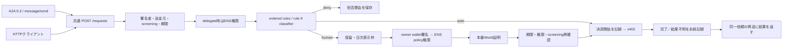

# 結合試験の修正と再試験 — 2026-09-26

監査で再現した不具合を修正し、通常依頼の所有者承認とA2A入口を接続した。
基点はmain `ebbce5e`。独立した `minta/integration-audit-20260926` で実装・試験した。
**自動試験の成功と、公開環境への反映・実機承認の成功は別の判定とする。**

## 修正内容

| 監査で見つかった点 | 修正後と検証 |
|---|---|
| 通常依頼を所有者が承認できない | `/owner/login`のウォレット署名、設定されたENSのpolicy書込権限、World証明を順に検証。来場者cookieでは承認不可 |
| 送金元省略・別のcleanアドレスの宣言で検査を迂回 | `authorization.from`を検査。宣言があれば一致を要求。実接続で送金元不明ならdeny |
| 期限切れ・不正な期限で自動決済 | 受付、screening等のawait後、決済直前に期限を確認。不正な価格・通貨・委任先も拒否 |
| 同じIDを別署名で再送すると二重決済 | 内容固定、排他、完了結果の再返却。決済開始を先に記録し、結果不明では再実行しない |
| 再起動で重複防止が消える | 完了結果と決済開始記録を保存。HTTPとA2Aの再起動後の再送を試験。支払い署名・cookieは保存しない |
| 日次上限が取得ごとの上限になっている | 通知時刻前は表示しない。回答後もその日の枠は消費済み。再起動でも枠を維持。来場者デモは所有者の枠を消費しない |
| A2A入口が404 | Agent Card、A2A 0.3 `message/send`・`tasks/get`、x402 metadataを共通HTTP受付へ接続 |
| 同じruleの拒否理由が一つに潰れる | 各依頼の理由を`/dropped`に表示 |
| 来場者経路のscreening未接続 | 最新mainのscreening＋classifier接続を取り込み、結合試験で呼び出しを確認。拒否された依頼ではデモ支払い署名を作らない |

所有者challengeはブラウザー・Origin・一回限りのnonceに束縛し、有効期間は5分。
ログインは30分で失効し、World証明ごとに権限を再確認する。
通知時刻と日付境界は`policy.timeZone`（既定`Asia/Tokyo`）で計算し、サーバーのTZに依存しない。
権限失効、ログアウト、依頼変更、期限切れ、取消、別ブラウザー、再送では決済しない。

## 検証

- `npm run check`：型検査、全体 **当時の全テスト / 12 claims**。
  最終コードは`TZ=UTC npm run check`でも成功。通知は所有者のタイムゾーンで判定する。
- `npm run integration:check`：独立した17項目が成功。
  実HTTP、実EIP-191/EIP-712署名、実Intercepta/x402アダプターを使用。
  外部API応答・World verifier・ENS権限は試験側で制御する。
  [証跡](evidence/integration-fixed-20260926.json)。
- 実サービスの読み取り確認を加えた23項目もすべて成功。
  公開health、実screening、実ENS取消状態、World RP登録、x402対応、
  過去の送金receiptを確認した。[実接続の証跡](evidence/integration-fixed-live-20260926.json)。
  RPCは制限中のPublicnodeからviemのSepolia標準RPCへ明示的に切り替えた。
- 支払い境界と再起動：[intake-boundaries.test.ts](../../src/server/intake-boundaries.test.ts)。
- 所有者とWorldの接続：[owner-approval.test.ts](../../src/server/owner-approval.test.ts)。
- A2Aと共通HTTPの接続：[a2a.test.ts](../../src/server/a2a.test.ts)。
- 日次表示制限：[attention.test.ts](../../src/server/attention.test.ts)。

この自動実行は新しい本番World証明やオンチェーン送金を作らない。
以前の公開World→Base Sepolia送金成功は
[WORLD-WALKTHROUGH](WORLD-WALKTHROUGH-2026-09-26.md)の別証跡である。

実接続では、通常依頼の実screening→rule 5 / HTTP 202まで確認した。
**新しい所有者ログイン＋World操作は実機確認待ち。ローカル送金は無効。**
設定済みPublicnode RPCは `-32005 / Rate limit exceeded` を返した。
`viem`のSepolia標準RPCによる読み取りでは、設定された所有者の`yh:policy`権限はtrue。
権限を取得できない間は承認を拒否する。screeningも一度拒否側に倒れ、
その後の実呼び出しでcleanを取得して保留まで進んだ。

## 公開サーバーへの反映

1. 変更を取り込み、`npm install`、`npm run check`を実行する。
2. 既存の本番IDKit、x402、screening、ENS設定を維持する。
   実決済＋mock identity、実決済＋未設定screeningの組み合わせは起動を拒否する。
3. `OWNER_WALLET_ADDRESS`を明示するか、`config/ens-deployment.json`と同じ名前・resolverを設定する。
   別の名前に既存デモ所有者を流用しない。
4. `REQUEST_STATE_FILE`と`ATTENTION_STATE_FILE`を永続領域に置く。
   初期値は `.yohaku/requests.json` と `.yohaku/attention.json`。
   **一組のファイルにつき一つのプロセス**で動かし、deploy時に消さない。
5. `/health`の`wired.ownerApproval`とAgent Cardを確認し、新しい通常依頼で
   ownerログイン→World→結果確認まで実行する。

未承認の支払い署名、ブラウザーセッション、学習履歴はメモリー内で、再起動すると失われる。
結果不明の記録は勝手に削除せず、チェーンと照合してから運用者が扱う。
これは複数サーバー向けの分散トランザクション実装ではない。

## 残る範囲

- 公開反映後の通常依頼による実World＋送金一体試験。
- 実端末でのキャンセルは未観測。サーバー側のcancel・拒否・期限切れは自動試験済み。
- A2A 1.0、streaming、push通知、複数taskを束ねる既存contextへの投入。
- 外部通知配信、個人の回答／データ配送、treasuryへの手数料回収。
- `/try`のmainnetアドレスはリスク検査用fixtureで、testnetデモ支払者の取引履歴を証明しない。
