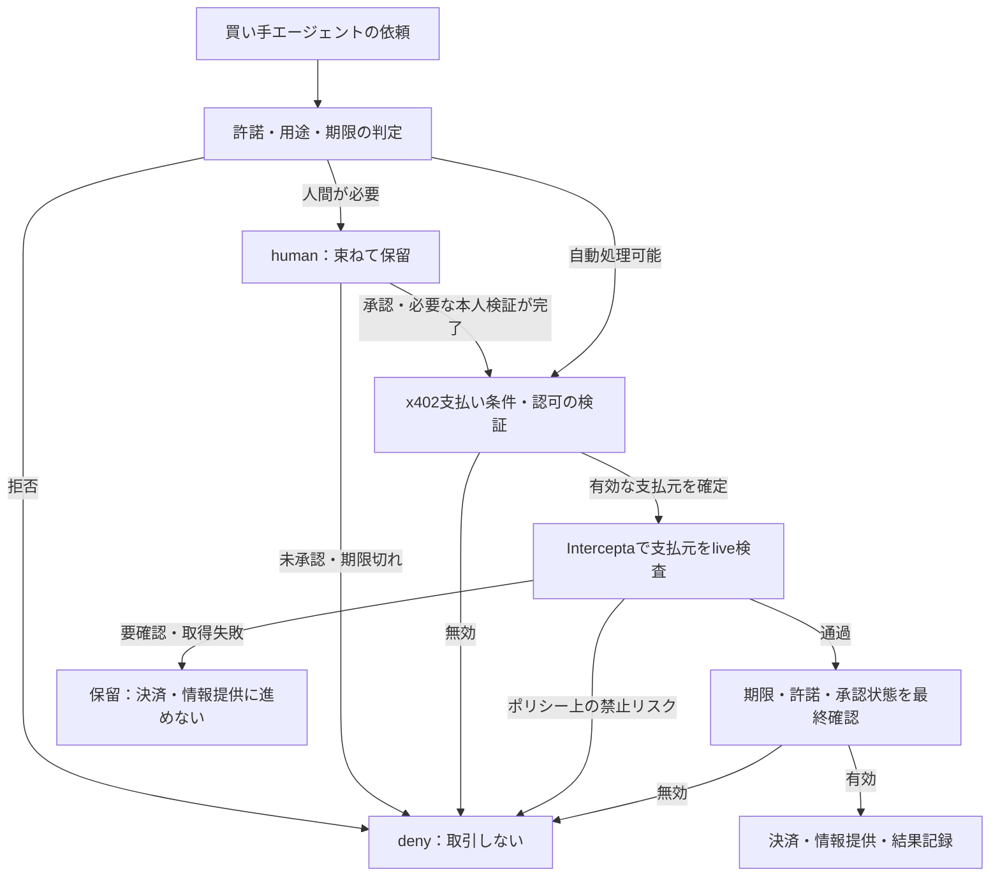

# InterceptaがNorenに効く理由 — 受取前のリスク検査

確認日：2026-09-25

**結論：今回のNorenには、買い手エージェントの支払元を検査する「受取側」の統合がよく合う。** Interceptaの公式賞要件は、x402サービスが支払元ウォレットを検査し、受取・決済に進むかを決める用途を明示している。[S1]

これは採用を検討するための調査・提案文書。**APIの疎通や統合は未実施で、以下のフローやデモは実装済みではない。** 公式情報と私たちの考察を区別する。プロダクト定義は[CONCEPT.md](../product/CONCEPT.md)を参照。

## 1. Interceptaは何をするか

公式には、オンチェーン決済のリアルタイムなセキュリティ・コンプライアンス層と説明されている。ウォレット、コントラクト、トークン、署名対象のメッセージ、トランザクションを調べ、リスクの判定と根拠を返す。[S1][S2]

| 調べる対象 | 公式に説明されている主な用途 |
|---|---|
| ウォレット・アドレス | 制裁・AMLリスク、盗難資金や詐欺との関連 |
| コントラクト | 悪意あるコントラクトとの関連や挙動 |
| トークン | 偽トークン、詐欺トークンなどのリスク |
| メッセージ・支払い認可 | 危険な署名や承認内容の検査 |
| トランザクション | 実行時の影響や残高変化などの検査 |

**「一回呼ぶと全部を検査する万能API」とは理解しない。** 対象別にAPIがあり、何を渡すか、どの情報が返るか、何を止めるかを選ぶ必要がある。Quick ScanとDeep Scanも別のエンドポイントである。[S3][S4]

Trust Wallet・1inch・P2P.orgの利用は、公式賞ページに記載されている。公式サイトにもTrust Wallet・1inchの掲載がある。ここでは提供者側の公開説明として扱い、全製品での利用範囲や検出精度を独立検証したとはしない。[S1][S2]

APIの判定はリスク判断の材料であり、相手の人格、データの正確さ、取引の適法性を保証するものとして扱わない。

## 2. Norenと一致する根拠

Norenは、人間の売り手に来る依頼を `auto` / `human` / `deny` に振り分ける。エージェントは情報を買う顧客であり、Norenがその内部動作を管理する前提ではない。

Interceptaの公式賞ページは、統合先を大きく3つ挙げている。[S1]

| 公式の方向 | 調べるもの | Norenでの位置づけ：考察 |
|---|---|---|
| 支払うエージェント | 宛先 `payTo`、トークン、支払い認可 | 買い手実装も管理する場合の拡張 |
| **受け取るエージェント・サービス** | **支払元ウォレットの制裁・盗難資金・詐欺リスク** | **今回の第一候補。売り手側で受取・決済前に検査する** |
| エージェントの取引相手リスク | 相手ごとのリスクと理由 | ルーティングの判断材料にできる |

**購入条件に合っていて、支払う意思もある相手を、そのまま通してよいとは限らない。** 許諾の条件と支払い元のリスクを独立に判定することで、「売れる情報でも、この取引は受けない」という判断ができる。

これは[CONCEPT.mdのdeny例](../product/CONCEPT.md#deny--12-of-52)にある、支払い元のリスクによる停止を実際の外部判定につなぐ提案である。単にダッシュボードへ危険度を表示するだけではない。

## 3. World・ENS・MultiBaasとは何が違うか

以下はNoren内での役割の整理であり、各製品の全機能を分類したものではない。

| 部品 | Norenで答えてほしい問い |
|---|---|
| World ID | 今この操作に関わる人間の証明・検証が成立したか |
| ENS／許諾ポリシー | このカテゴリ・用途・期間の依頼を許可できるか |
| **Intercepta** | **この支払元などに、取引を止めるべき既知のオンチェーンリスクがあるか** |
| x402 | 支払い条件と認可をやり取りし、検証・決済につなげられるか |
| MultiBaas | 採用する実行構成の中で、どのチェーン操作・記録取得を担うか |
| Norenルーター | これらの結果から、自動処理・人間確認・拒否のどれに進めるか |

**考察：MultiBaasとInterceptaが「どちらも決済に関係する」だけで、役割が重複するとは言えない。** 実行・台帳と、外部のリスク情報に基づく受取可否判断は分けられる。

World IDを通ったことは支払い資金の安全性の証明ではない。ENSで名乗ったことも、実際の支払元アドレスの安全性を保証しない。それぞれの確認を代用しない。

## 4. 提案する最小フロー

初期統合では**受取側に絞り、支払元アドレスを検査する**。

図は論理的な順序であり、x402の全方式に共通の実装コードを示してはいない。SDK・方式に合わせ、**検査で拒否した場合に決済も保護対象の情報提供も実行されない**ことを確認する。

受取側で検査する時点では、買い手が支払い認可に署名済みの場合がある。したがってこの実装は「買い手の署名前に止めた」ではなく、**「サービスの受取・決済前に止めた」**と説明する。それが公式賞要件の一つの選択肢である。[S1]

### 判定とNorenの分岐

下表はNoren側の提案であり、APIの正式なレスポンス値ではない。

| 検査結果・状態 | Norenの扱い |
|---|---|
| 検査通過、許諾条件も有効 | `auto`として決済へ進める |
| ポリシー上、取引禁止に該当 | `deny`。決済・情報提供を止める |
| 人間が判断可能な曖昧なリスク | `human`に保留し、理由を示す |
| タイムアウト・APIエラー・解釈できない応答 | 検査未完了として保留。相手を悪質と断定しない |
| 保留したまま期限切れ | `deny`。沈黙を承認にしない |

明確な禁止条件を、人が「承認」を押せば解除できるようにはしない。また、少額にすればどのリスクも受容できるとは考えない。

賞の説明には金額制限も例示されるが、Norenは受取側なので、MVPで無理に実装する必要はない。価格を変更する場合も、署名済みの認可を勝手に書き換えず、採用する決済方式の条件を満たす必要がある。

## 5. 使うAPIと実装前の確認

公式賞ページは `docs.web3antivirus.io` をAPIリファレンスとして案内している。ドメインがIntercepta名でなくても、今回はこちらが公式の案内先。[S1]

| API | 公開仕様で確認できた内容 | 今回の候補 |
|---|---|---|
| Quick Scan Address | `GET /api/public/v2/extension/account/{address}/quick-scan`。低遅延用途の高水準リスク評価 [S3] | 返却理由が要件を満たすなら最初の検査 |
| Deep Scan Address | `GET /api/public/v2/extension/account/{address}/toxic-score`。制裁・資金洗浄・詐欺などのフラグを説明 [S4] | 今回の支払元検査の有力候補 |
| Scan Message | 支払い認可の検査として賞ページが案内 [S1] | 買い手側検査を追加する場合 |
| Scan Token | 本物のトークンと類似品の検査として賞ページが案内 [S1] | 複数トークンを受け付ける場合の拡張 |

APIホストは公開資料では `https://api.web3antivirus.io`。**認証ヘッダー、実際のJSON、判定基準、レート制限、キーで使えるAPIの範囲は疎通時に確認する。** 固定の `clean` / `flagged` などが返ると仮定して実装しない。

全APIを呼ぶことが目的ではない。最初は一つで、通過と停止の両方を実際に返せるか確認する。ただし、Quick Scanだけで必要な制裁情報や理由が得られると未検証で断定しない。

### x402との接続で先に確認すること

公式x402資料には、検証・決済の前後にフックを置く仕組みがある。`onAfterVerify`では検証後の拒否、`onBeforeSettle`では決済前の拒否が可能と説明されている。[S6]

実装では、採用SDKの版・決済方式を固定して、次を確認する。

- **支払元を自己申告の文字列から取らない。** 有効な支払い認可に対応する支払元を検証し、そのアドレスを検査する。リクエストのENS名との関係が必要なら別途検証する。
- 情報提供後の決済フックだけに検査を置くと、情報を先に渡す可能性がある。保護対象のハンドラーを実行する前にも拒否できる構成にする。
- 保留から復帰するときは、期限・許諾・承認・検査結果の鮮度を再確認する。必要なら新しい支払い認可を求める。
- 同じ支払いの再試行で二重決済しない。検査ログと決済結果を同じ依頼に結びつける。
- x402のfacilitatorとMultiBaasが同じ代金を二重に送金しないよう、**決済を送信する主体を一つに定める**。
- x402標準クイックスタートのテスト用facilitatorはBase SepoliaとSolana devnetを案内する。既存構想のEthereum Sepolia・JPYC建て決済がそのまま利用できるとは限らない。チェーン・トークン・方式・facilitatorの組合せを先に疎通する。[S7]

## 6. 賞要件との対応

公式賞ページの対象は **Safe Agent-to-Agent Payments with x402：計$2,000（1位$1,250、2位$750）**。別の$500はContinuity限定であり、今回の新規開発の対象として数えない。[S1]

| 公式要件の要約 | Norenで示すこと |
|---|---|
| 動くエージェント決済。x402推奨、テストネット可 | 買い手エージェントが依頼し、通過した取引を決済する |
| 署名または受取前のlive API呼び出しと、結果に基づく分岐 | 受取側で支払元を検査し、通過／拒否・保留を実行する |
| モック・固定応答は不可 | 実際のAPI結果を使う。検査の理由をハードコードしない |
| リスクデータはmainnet対象 | テストネット決済でも実在mainnetアドレスを検査する |
| 通過1件と、拒否または保留1件。理由を表示 | 同じ許諾条件でも支払元のリスクで結果が変わる場面を見せる |
| 公開GitHub、READMEにAPI呼び出し箇所と3〜5行のフィードバック | 実装後にファイルリンクと実際の体験を追記する |

無料sandboxキーは公式フォームから申請でき、1キー1,000リクエスト、メールで数時間以内の配布、審査まで有効と案内されている。既知のリスクを持つアドレスは大会Discordチャンネルのピン留めを参照する。[S1][S5]

**今回の作業ではキー申請・API呼び出しはしていない。** 実装開始時の最初の到達点は、実際のキーで通過・停止の2種類の結果を確認すること。

APIキー申請ページは賞金を総額$2,500の3チームとして表示する一方、大会の正式賞ページは$500をContinuity限定と分けている。応募区分の判断は正式賞ページの条件に従う。[S1][S5]

## 7. デモへの組み込み案

**既存の52件を増やさず、12件のdenyのうち1件をInterceptaによる拒否にする。** 38件auto・2件humanという既存のデモ設定を保つ案。

| 場面 | 許諾条件 | Intercepta | 結果 |
|---|---|---|---|
| A：購買意図を買うエージェント | 範囲内 | 実際の検査で通過 | テストネット決済が成功 |
| B：同じ種類の依頼、異なる支払元 | 範囲内 | 実際の検査で停止対象 | 受取を拒否し、情報も渡さない |
| C：既存の人間キューの依頼 | 人間の判断が必要 | 承認後の決済前にも検査 | 本人承認とリスク検査を両方満たして進む |

Bで検査結果が「保留」に相当する場合は、denyへ数合わせせず、最終状態または説明する件数を整合させる。

デモで見せる証跡は、検査対象、結果と理由、検査時刻、Norenの分岐、取引結果。APIキーやセンシティブな申請本文は画面・公開ログに出さない。

**署名の有効な危険アドレスをどう用意するかは実装前の重要な確認点。** 公開されている制裁対象アドレスの秘密鍵を持っている前提にはできない。別の自分のウォレットで署名し、検査だけ無関係な危険アドレスへ差し替えて「その支払元を止めた」と見せてはいけない。

スポンサーに、支払い認可まで検証できるデモ用アドレス・テスト方法を確認する。確保できない場合は、未認証段階の検査で何を証明できたかを限定して説明するか、管理できる買い手で危険な受取先を検査する別のデモ構成を検討する。

エクスプローラに送金がないだけでは、Interceptaが止めた証拠にならない。**live判定が拒否・保留を決め、決済処理に進まなかったこと**を追えるようにする。

## 8. この統合から得られる示唆

以下は私たちの考察。

1. **承認の省力化だけでなく、受けない取引を自動判断できる。** 人間が寝ていても売上だけを優先しない仕組みになる。
2. **リスク情報を自前で集めることより、売り手の意思と結びつけることに集中できる。** Interceptaの判定を、Norenの許諾・期限・例外承認へ接続する点が製品価値になる。
3. **人間キューを増やしすぎない設計が必要。** 全ての警告を即通知すると元の問題に戻る。明確な禁止は拒否し、判断可能な例外だけ束ねる。API障害は運用上の保留として扱う。
4. **アドレスのリスクと、エージェントの評判は別。** 拒否率が高いことを詐欺の証拠とせず、オンチェーンの検知結果とも混ぜない。
5. **賞への適合と製品の責任分界が一致する。** 外部APIの結果を表示するだけでなく、売り手の受取前に実際の判断を行うことが、公式の審査の焦点と合う。

ENSとの関係では、Interceptaは階層許諾や取消の代替ではない。賞の応募枠の選択と、製品としてどの機能を使うかは別々に判断する。この文書だけで3枠目の応募先を確定したことにはしない。

## 9. 次に確認すること

- sandboxキーで利用できるAPI、認証方法、レスポンス、理由の表示方法。
- Norenの支払元検査に適したAPIと、通過・停止が返るアドレス。
- 署名検証と整合するデモ用支払元を用意できるか。
- x402のチェーン・トークン・方式・facilitatorとMultiBaasの担当範囲。
- 受取前・情報提供前の検査、保留・期限切れ・再試行・API障害時の挙動。
- 実装後、READMEへ呼び出しファイルと3〜5行の実体験を記載する。

## 出典

すべて確認日現在の公開資料。本文中の機能・応募要件は資料の説明であり、APIの実測結果ではない。

- **[S1]** [ETHGlobal Tokyo 2026 — Intercepta賞の正式要件](https://ethglobal.com/events/tokyo2026/prizes/intercepta)
- **[S2]** [Intercepta公式サイト：製品概要・利用企業](https://intercepta.io/)
- **[S3]** [公式API：Quick Scan Address](https://docs.web3antivirus.io/reference/quick-scan-address)
- **[S4]** [公式API：Deep Scan Address](https://docs.web3antivirus.io/reference/scan-address)
- **[S5]** [ハッカソン向けAPIキー・利用条件](https://intercepta.io/ethglobal)
- **[S6]** [x402公式：Lifecycle Hooks](https://docs.x402.org/advanced-concepts/lifecycle-hooks)
- **[S7]** [x402公式：Quickstart for Sellers](https://docs.x402.org/getting-started/quickstart-for-sellers)
