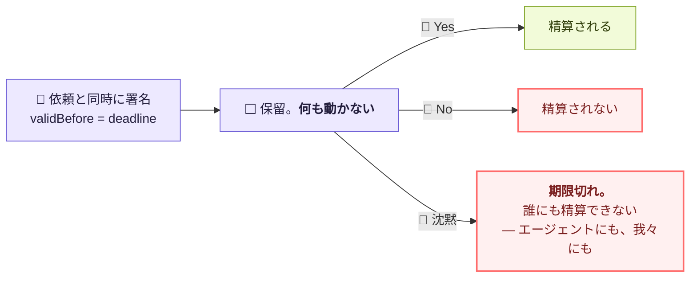

# x402 — 現物から確かめたこと

**確かめた日: 2026-09-26。** 記事ではなく、**動いている facilitator に直接聞いた結果**です。

**先に、一番ハマるところ。**

> **公開されている npm の `x402` パッケージは、いまも v1 を喋ります。**
> ヘッダは `X-PAYMENT`。しかし**デプロイされている facilitator は `x402Version: 2`** を返し、
> v2 のヘッダは **`PAYMENT-SIGNATURE`**。**記事どおりに作ると噛み合いません。**

---

## 1. 生きている facilitator に聞いた結果

```
GET https://x402.org/facilitator/supported  → 200
```

```json
{"kinds":[
  {"x402Version":2,"scheme":"exact","network":"eip155:84532"},
  {"x402Version":2,"scheme":"upto","network":"eip155:84532",
   "extra":{"facilitatorAddress":"0xd407e409E34E0b9afb99EcCeb609bDbcD5e7f1bf"}},
  {"x402Version":2,"scheme":"batch-settlement","network":"eip155:84532"},
  {"x402Version":2,"scheme":"exact","network":"solana:…"},
  {"x402Version":2,"scheme":"exact","network":"algorand:…"} ]}
```

| | |
|---|---|
| プロトコル | **v2** |
| 使うスキーム | **`exact`**（`upto` と `batch-settlement` もあるが使わない） |
| ネットワーク | **`eip155:84532`（Base Sepolia）だけ。** mainnet も、**Ethereum Sepolia（`eip155:11155111`）も無い** |
| 鍵 | **不要。** 無料の testnet facilitator |
| 検証 | `POST /verify` — `{paymentPayload, paymentRequirements}` |
| 精算 | `POST /settle` — 同じ body |

**我々のサーバは起動時にこの `/supported` を叩いて、設定されたスキームとネットワークが
本当に載っているかを確かめます。** ネットワーク文字列の5文字の間違いが、審査員が払う瞬間に
初めて出るのを避けるためです。

### ⚠️ ENSv2 とは別のチェーンです

**ENSv2 は Ethereum Sepolia（11155111）、x402 の決済は Base Sepolia（84532）。**
`eth_getCode` で両方に当てて確認済み（[ENSV2-ONCHAIN.md](ENSV2-ONCHAIN.md) §0）。
**同じ「Sepolia」でも入れ替えは効きません。** 資金も両方に要ります。

## 2. 使うパッケージ

| パッケージ | version | プロトコル | 依存 |
|---|---|---|---|
| `x402` | 1.2.0 | **v1**（`X-PAYMENT` のみ） | viem, **wagmi, solana 一式** |
| `@coinbase/x402` | 2.1.0 | v2 | `@coinbase/cdp-sdk`, `@x402/core` |
| **`@x402/core`** | **2.27.0** | **v2** | **zod だけ** |

> **`@x402/core` を使いました。** `PAYMENT-REQUIRED` / `PAYMENT-SIGNATURE` /
> `PAYMENT-RESPONSE` のエンコーダと facilitator クライアントを持っていて、依存が zod だけ。
> ハッカソンの提出物に wagmi と Solana 一式を引き込むのは、それ自体がリスクです。

**受け取りは両方のヘッダを読みます。** v1 の記事を見て作られたクライアントからも払えるように。

## 3. `exact` / EIP-3009 — 払う側にガスが要らない

> *"The `exact` scheme on EVM executes a transfer where the **Facilitator (server) pays the
> gas**, but the Client (user) controls the exact flow of funds via cryptographic signatures."*
>
> *"In all cases, **the Facilitator cannot modify the amount or destination.** They serve only
> as the transaction broadcaster."*

**買い手のウォレットに必要なのは USDC だけで、ETH は要りません。** ブースで財布を出して
もらうときに、これが効きます。

署名するのは `transferWithAuthorization` の EIP-712 メッセージ:

```
from, to, value, validAfter, validBefore, nonce
```

## 4. ここが設計上いちばん効いた — `validBefore` は我々の deadline

**依頼は `deadline` を持っています。** そして EIP-3009 の認可は `validBefore` を持っています。
**この2つを同じ値にしました。**



> **「沈黙は同意ではない」が、サーバの約束ではなく署名の有効期限になりました。**
> 彼女が答えなければ認可は失効し、**我々を含めて誰も精算できません。**

**待っている間、エージェントは1円も損をしません。** EIP-3009 の認可は、精算されるまで
何も動かさないからです。だから「寝ている間、お金は止まったまま」が実際に成立します。

そして**期限より先に切れる認可は受け取りません。** 受け取れば「順番待ちです」と言いながら
**完了しえない支払いを待たせること**になる。テストで固定してあります。

## 5. 二つの財布を混同しない

| | 誰のものか | 必要なもの | ブースでは |
|---|---|---|---|
| **payout address** | **売り手**（人間） | なし。公開情報 | **審査員自身のウォレット。**自分の残高が増えるのを見る |
| **agent private key** | **買い手**（エージェント） | **USDC だけ**（ETH 不要） | こちらが用意して資金を入れておく |

投入は `npm run setup:wallet` → `http://127.0.0.1:4175`。**ローカルのみ・`.env` は 0600・
秘密は画面にもログにも返しません。**

## 6. 実物で通したところ（2026-09-26、資金なし）

**着金以外は全部通りました。** facilitator は本物を叩いています。

```
npm run agent -- routine
  402 — 120 atomic units of 0x036C…CF7e on eip155:84532
  paid → 402
  "reason": "invalid_exact_evm_insufficient_balance"
```

**この返事が重要です。** `insufficient_balance` ということは、facilitator まで届いた上で
**PaymentRequirements も EIP-3009 の署名も受理され、残高だけが無い**という意味になります。
スキーマが違っていれば、ここまで来ません。

```
npm run agent -- sensitive
  202 held — 4200 JPYC is above the threshold
  re-sent with an authorization → 202
  "accepted": false, "reason": "invalid_exact_evm_insufficient_balance"
```

保留側も同じところまで到達。**残高が入れば、そのまま保持されます。**

起動時のチェックも通りました。

```
settlement  x402 → eip155:84532
facilitator: supports exact on the configured network
```

### 走らせて見つけた不具合が2つ

**どちらもテストでは出ず、実物で1回動かして出たものです。**

| 見つかったもの | 直し方 |
|---|---|
| **期限ちょうどの認可が弾かれた。** エージェントが `validBefore` をミリ秒から**切り捨て**ていたので、合致しているはずの期限に最大999ms足りなかった | **秒で比較する。** EIP-3009 には秒しか無いので、それ以上の精度で争うこと自体が誤り。エージェント側も切り上げ＋60秒の余裕を持つようにした |
| **拒否理由が「no success」に潰れていた。** `settle` は `errorReason`、**`verify` は `invalidReason`** と、フィールド名が違う | 両方読む。潰れた理由は、原因が「残高不足」なのか「payload が不正」なのかを見分けられなくする |

**2つ目のほうが重い。** 理由が潰れていると、当日ブースで詰まったときに**どこを直せばいいか分からなくなります。**

## ⚠️ 確かめていないこと

- **mainnet。** この facilitator は Base Sepolia しか持っていません
- **JPYC では精算していません。** testnet の USDC です。**画面に出る金額の単位が
  依頼の単位（JPYC）と違う**ことは、そのまま書くこと（[ASSUMPTIONS.md](../product/ASSUMPTIONS.md) D3）
- `upto` と `batch-settlement` は使っていません。**1件1決済**です
- **実際の着金だけ、まだ通していません。**残高が入ればそこだけが埋まります（issue #2）

## 出典

- 仕様 v2 — `coinbase/x402` `specs/x402-specification-v2.md`
- HTTP トランスポート — 同 `specs/transports-v2/http.md`（`PAYMENT-REQUIRED` / `PAYMENT-SIGNATURE`）
- `exact` / EVM — 同 `specs/schemes/exact/scheme_exact_evm.md`
- 生きている facilitator — `GET https://x402.org/facilitator/supported`（実行して確認）
- Linux Foundation での発足 — [Coinbase + Cloudflare](https://www.coinbase.com/blog/coinbase-and-cloudflare-will-launch-x402-foundation)
- 候補値と、その出所 — [`config/x402-suggestions.json`](../../config/x402-suggestions.json)
