# Architecture

> **One layer was missing.** Identity, permission, settlement and ledger all exist today.
> **Nothing stands between an agent's request and a person's attention.**
> Yohaku is that layer.

---

## 1. Layers, and who answers what

| Layer | The question it answers | Provided by | Sponsor |
|---|---|---|---|
| **L1 Identity** | *Is this a real person?* | World ID | **World** |
| **L2 Permission** | *What is this party allowed to ask for?* | ENSv2 + EAC | **ENS** |
| **L3 Routing** ★ | ***Pass it, ask her, or drop it?*** | **Yohaku** | **— (the gap)** |
| **L4 Settlement** | *May this money move, and under what limits?* | x402 + MultiBaas | **Curvegrid** |
| **L5 Ledger / Learning** | *What happened, and what did she decide?* | Ledger, decision store | **Curvegrid** |

**The three sponsors do not overlap.** Each answers a different question, and each can be
explained in one sentence. That separation is deliberate — it is also why payment screening
was not made the third slot: it would have sat on top of L4 and blurred Curvegrid's story.

## 2. Actors and trust boundaries

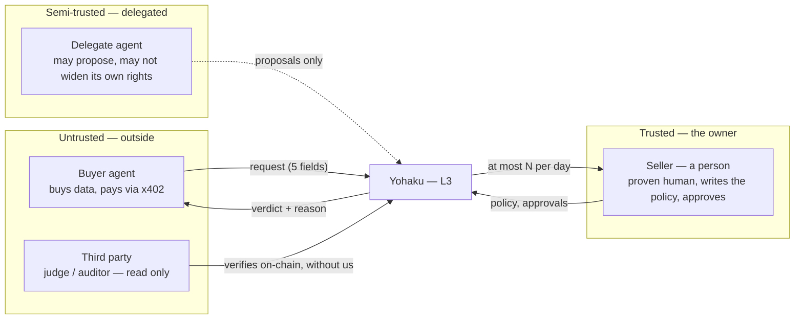

**A1 and A3 are judged on different axes.** A buyer agent is asking *for* something;
a delegate agent may be trying to change *what is allowed*. Rule 0 exists for the second case.

## 3. Components

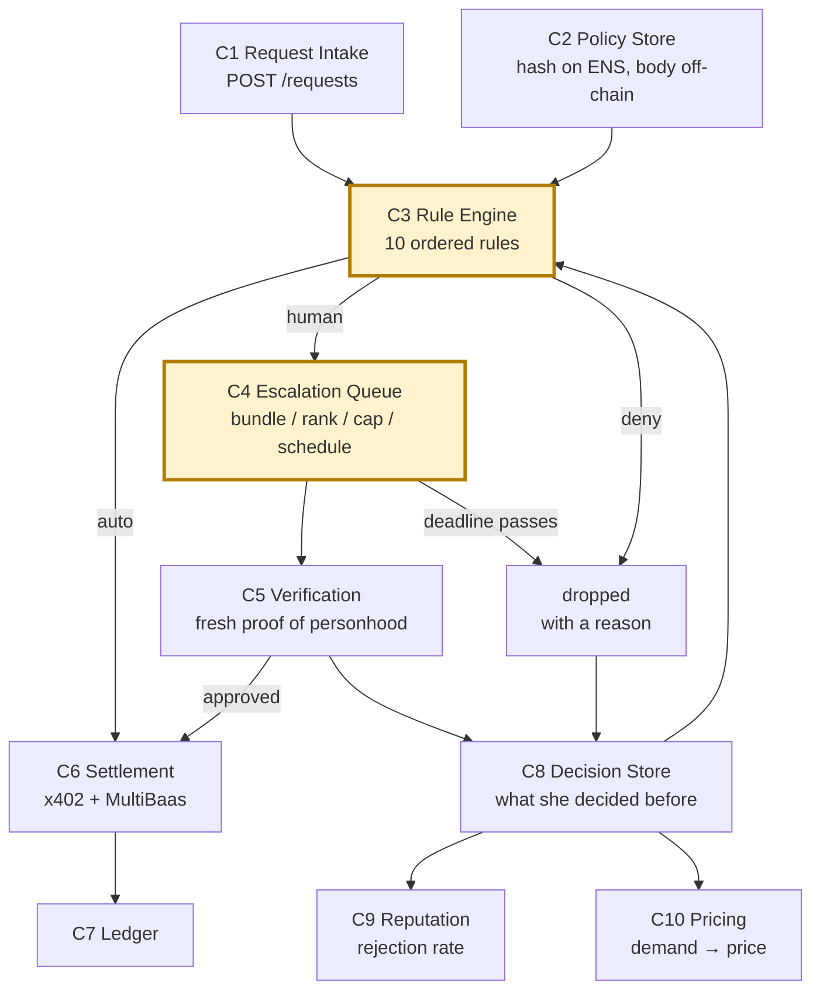

**C3 and C4 are the product.** Everything else is either a sponsor's layer or bookkeeping.
C10 is out of scope for the hackathon; C8 and C9 ship as a single chart and a single panel.

## 4. Routing — ten ordered rules

**Evaluated top-down. The first match decides.**

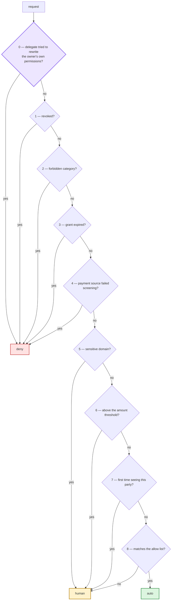

Two things are worth noticing.

**Rule 0 is on a different axis from the rest.** Rules 1–9 judge a request arriving from
outside. Rule 0 judges the delegate on the inside. Handing work to an AI and letting an AI
widen its own authority are different events, and only the second one is an attack.

**Rule 9 — "nothing matched" — falls to `human`, never to `auto`.** A system that routes the
unknown to `auto` is a system nobody can explain after an incident.

### Which of these are actually new

Ten rules are too many to narrate in four minutes. Three of them are new to the agent economy;
the rest are ordinary access control and would work the same way in a web2 product.

| The shift | Rules |
|---|---|
| **"I stopped" does not propagate.** A person says it once and is done. **Agents keep arriving, unaware** | 0, 1, 3 |
| **First-time counterparties never stop arriving.** A person meets a few strangers a year; **new agents are born daily** | 7, 9 |
| **You must decide in advance what silence means.** People sleep. Agents cannot wait | defaults (§5) |

## 5. Failure — everything falls to `deny`

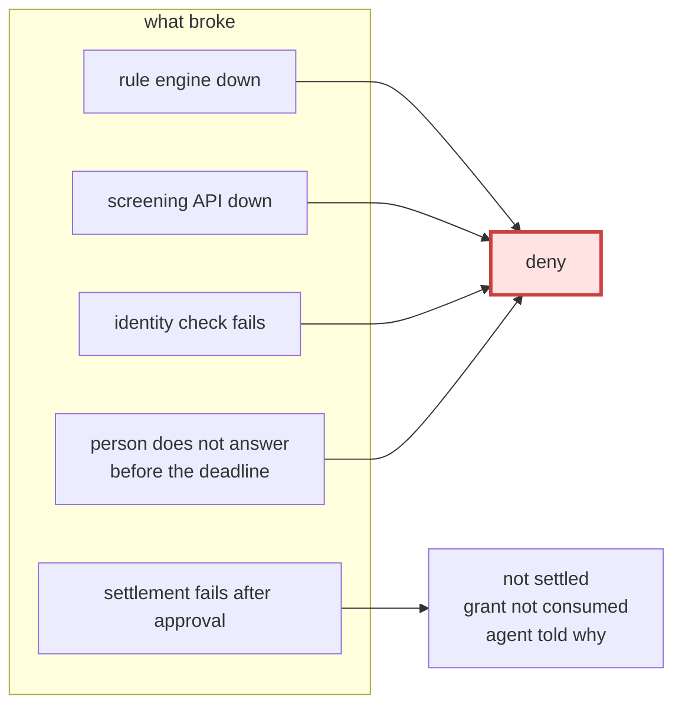

**There is no path that fails open.** This is the answer to the hardest question a judge can
ask — *what happens when your service is down?* — and it is the same answer every time.

**Silence is not consent.** A signal that cannot distinguish "quiet" from "dead" is not a signal.

## 6. Permission boundary — what ENSv2 is for here

**We do not claim that revocation is unique to ENSv2.** Comparable arrangements exist in v1.
The claim is narrower, and it is the one that matters when an AI holds the keyboard:

> **You can delegate to an AI without letting the AI rewrite what it is allowed to do.**

| Actor | May | May not |
|---|---|---|
| Owner's admin account | Update policy; grant and revoke delegation | — |
| **Delegate agent** | **Update the proposal key only** | **Update permission keys or the payout address** |
| Buyer agent | Read the published terms | Write anything |

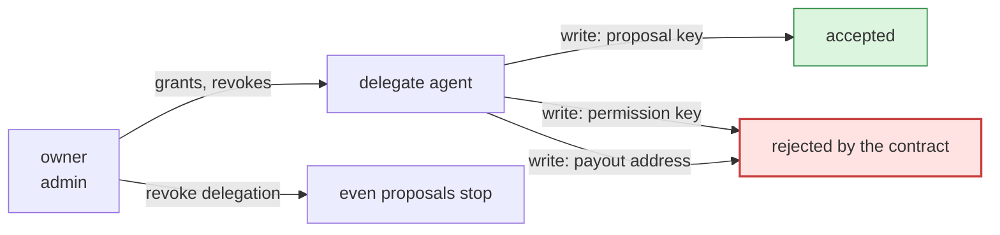

**Rejected by the contract, not by our server.** A third party can verify the boundary
without trusting us — which is also the demo.

⚠️ Key permissions on a permissioned resolver apply across **every name in that instance**.
Independent sellers must be scoped, never pooled into one resolver without isolation.

## 7. One night, end to end

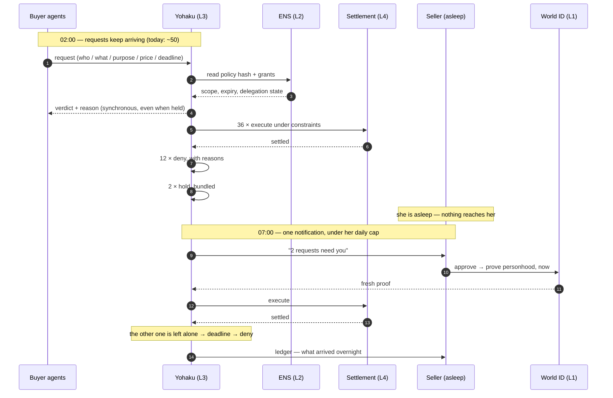

**The synchronous verdict on step 4 is the part people miss.** An agent that is left waiting
is an agent that is stuck, so even `human` returns immediately: *held, deadline at T*.

## 8. Data flow

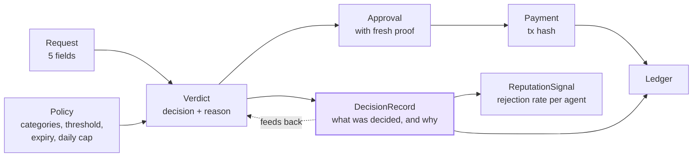

**The dotted line is the flywheel.** Past decisions become inputs to future routing, which is
why escalations fall over time. What accumulates is *a record of when a human said no* —
the one thing that cannot be synthesised.

## 9. State machines

Three separate lifecycles. **Keeping them apart is what keeps the implementation honest.**

### 9-1. Request

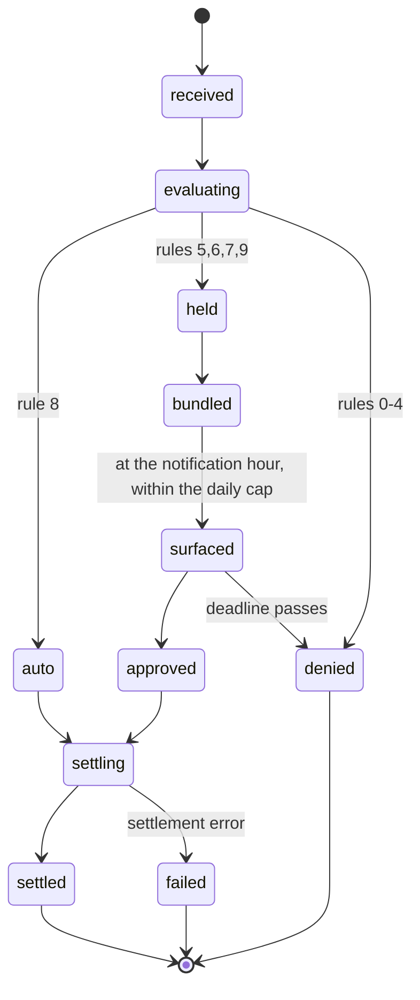

### 9-2. Grant

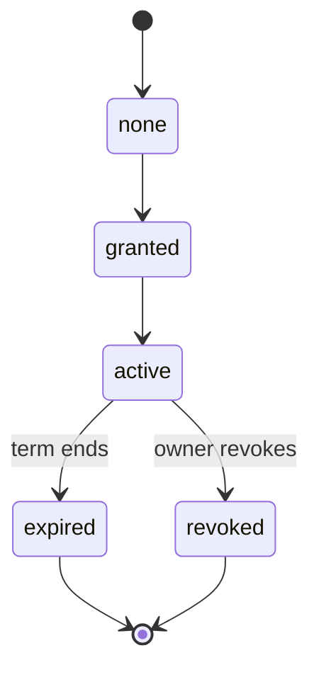

### 9-3. Delegation

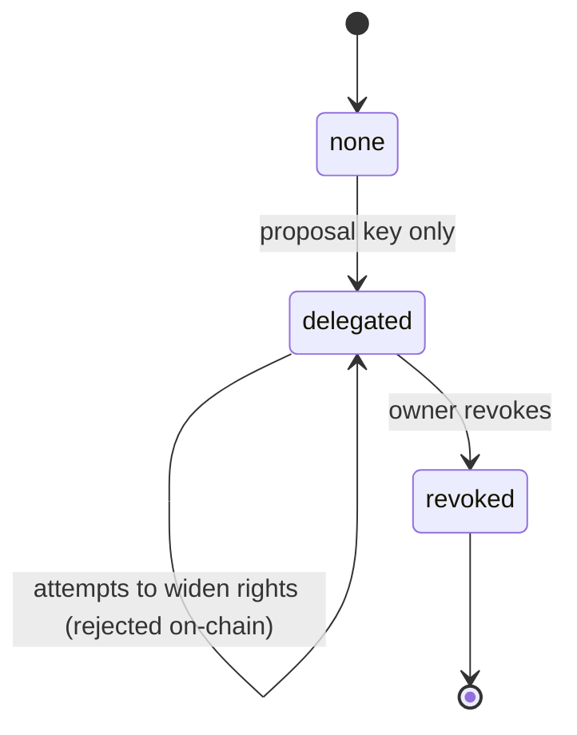

## 10. Screens

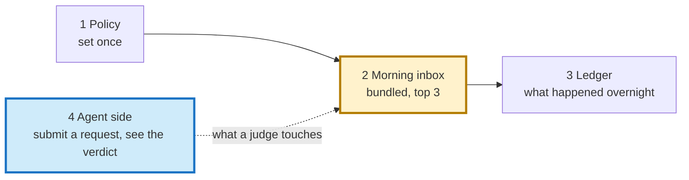

**Screen 4 is the one that wins the booth.** Judging happens one person at a time; asking a
judge to type *"give me her health data"* lets them draw `human` with their own hands.

## 11. Where each sponsor lands

| Sponsor | Layer | The moment it shows up in the demo |
|---|---|---|
| **World** | L1 | **Approving at 07:00 triggers a fresh verification**, and the ignored request shows the **denied path where the protected action does not occur** |
| **ENS** | L2 | **A delegate's write to a permission key is rejected on-chain**, and anyone can check it in the ENS app |
| **Curvegrid** | L4, L5 | **36 settlements execute inside the owner's constraints**, and the morning ledger shows what needs attention |
| *(intercepta — alternative)* | inside rule 4 | A payment is screened **before signing**, and the result decides what happens next |

---

## 12. What is deliberately not here

| | Why |
|---|---|
| Dynamic pricing (C10) | Strong, but the night works without it |
| Delivery of the purchased data | Mocked — not the subject |
| Multi-category policies | One category (purchase intent) for 36 hours |
| Reputation API | One panel in the UI; the API is roadmap |
| ER diagram, deployment topology | A table covers it until the implementation settles |

*Numbers referenced here are demo values. Their basis is recorded in [ASSUMPTIONS.md](ASSUMPTIONS.md).*
