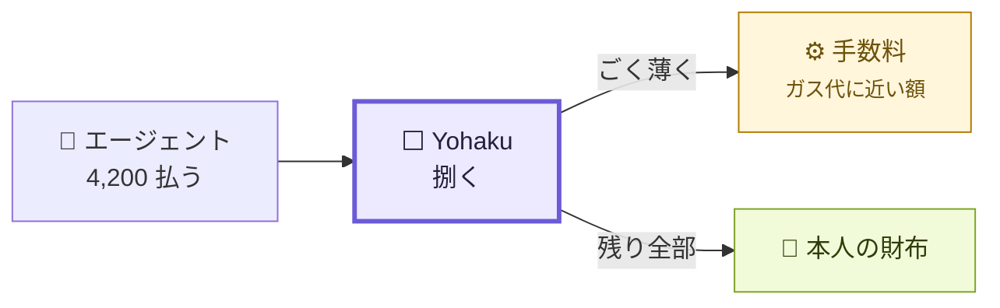
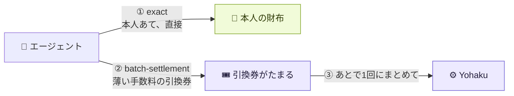
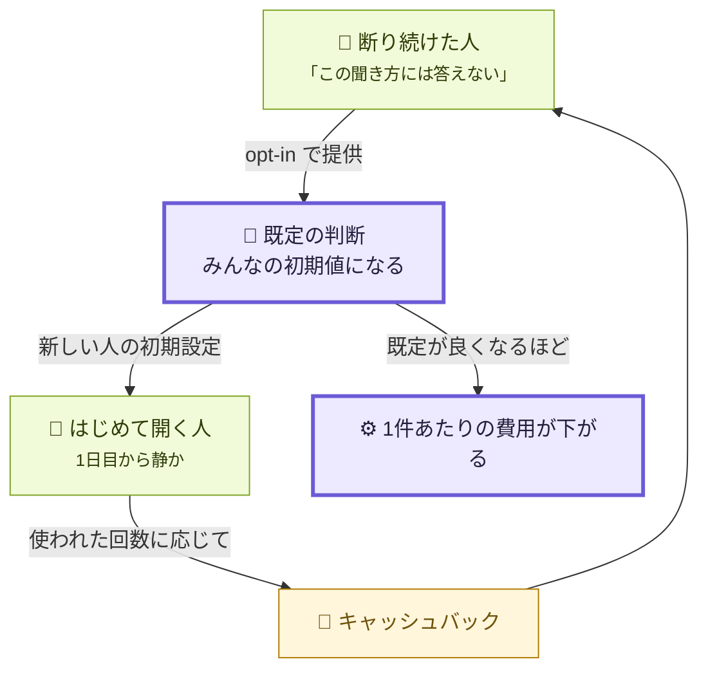

# 余白は、どうやって食べていくのか

> ⚠️ **この文書は設計であって、実装ではありません。**
> **いまこの瞬間、Yohaku は手数料を1円も取っていません。** x402 の `payTo` は売り手本人で、
> 我々は金の受け取り手として経路に入っていません。
> 実装済みのものは [STATUS.md](../build/STATUS.md) を見てください。

## 1. どこで取るか — 通り道で、ごく薄く

エージェントの依頼を**一手に引き受けて処理する**のが Yohaku の仕事です。
処理が終わり、金が動く瞬間に、**ガス代と同じくらいの薄さ**で手数料を引き、残りを本人の財布へ送る。

**額ではなく薄さが要点です。** ここが重いと、人は窓を開けません。
**開かなければ市場が立たず、我々の取り分も無い**ので、利害が一致しています。

### 穴があり、仕様の中に答えがありました

**x402 の `exact` は支払先が1つです。** `payTo` はひとつのアドレスで、facilitator は
**金額も宛先も変えられません**（それが x402 の安全性の根拠でもあります）。
だから「売り手に払わせて、途中で薄く抜く」はできません。

中継して抜く形（`payTo` を我々にして、そこから本人へ送る）は**採りません。**
**一度預かることになり、「我々は金を預からない」というこの製品が言える一番強いことを失います。**
薄い手数料と引き換えにするには高すぎます。

**仕様を読んだら、別の方式がありました。**

| スキーム | 何をするか | ここでの使い道 |
|---|---|---|
| **`exact`** | 決まった額を、1つの宛先へ | **売り手への支払い。本人へ直接**。我々は経路に入らない |
| `upto` | 上限つきで認可し、消費実績で確定 | 従量課金向け。ここでは使わない |
| **`batch-settlement`** | **依頼ごとに署名だけ受け取り、送金は後でまとめて** | **我々の手数料。これ** |

> **`batch-settlement` の仕様が名指ししている状況が、まさに我々のものでした。**
> *"gas fees exceed the value of individual requests"* — **1件あたりの手数料がガス代より小さい**とき。

**本人の金は、一度も我々を通りません。** 我々が受け取るのは引換券で、
**ガス代が惜しくない量になってから、1回でまとめて換金**します。

**そして Koe のような窓口も、同じやり方で自分の分を取れます。**
誰も他人の金を預からないまま、複数の関係者が手数料を受け取れる形です。

### 取るのは「送金の上前」ではなく「捌いた仕事の対価」です

引換券が発行されるのは、**我々が仕事をした瞬間**です。10段の判定を回し、束ね、
上限を守り、World ID で人であることを確かめた。**その仕事に対して請求します。**

**これは言い方の問題ではありません。** 上前をはねるなら金額に比例しますが、
**捌いた仕事に対してなら、件数に比例します。** 後者は、
**高い依頼をわざと人に上げる動機が我々に生まれない**という意味でもあります。

⚠️ **どれも実装していません。** `batch-settlement` は facilitator が対応を公表しているだけで、
**我々は一度も叩いていません。**

## 2. いつ取るか — 最初は取らない

| 段階 | 課金 | なぜ |
|---|---|---|
| **はじめ** | **無料** | 使われないものに課金しても、何も分からない |
| **流量が出てから** | **トラフィック課金／レベニューシェア** | 捌いた件数に比例する。**使われるほど払う**が、**捌けた分しか払わない** |
| **判断を覚えさせる** | 少し高い | 条件を自動で学習して、聞かれる回数をさらに減らす。**減った分の一部をもらう** |

**「聞かれずに済んだ数」が価値なので、課金もそこに紐づくのが素直です。**
朝の件数が減ったぶんだけ払う、という形にできれば、**買う理由と払う理由が同じ**になります。

## 3. そして、返ってくる方向 ★ ここが新しい

**自分の判断の仕方を、プラットフォームに提供できるようにします。**
それが他の人の初期値として使われた回数に応じて、**手数料がキャッシュバックされる。**

**なぜこれが効くか。** 合成できないものは「人がどこで断ったか」でした
（[CONCEPT §0](CONCEPT.md)）。**その断り方そのものが、次の人の初期値になります。**

- 新しく開いた人が、**1日目から静か**になる
- 提供した人には、**使われた回数ぶん**返る
- 既定が良くなるほど、**1件あたりの費用が下がる**

**開いたプラットフォームが、自分で安くなっていく形**です。

### ⚠️ ここは、自分たちの原則と擦れます

**「判断の仕方を提供する」は、我々が希少だと言ったものを差し出すことです。**
だから条件を先に決めておきます。

| | |
|---|---|
| **opt-in のみ** | 既定では提供しない。**黙って集めない** |
| **中身ではなく形** | 「何を断ったか」ではなく「**どういう聞き方を断る傾向があるか**」。
 個別の依頼文も、相手も、価格も出さない |
| **抜けられる** | 提供をやめたら、以後の既定から外れる。**過去の分は取り戻せない**と正直に言う |
| **人物像を作らない** | 傾向1つにつき1つ。**要約された人物像は、描写のつもりで人を操縦し始める** |

**ここを曖昧にしたまま出すなら、この節ごと出さないほうがいいです。**

## 4. 言ってよいこと／まだ駄目なこと

| 言える | 言えない |
|---|---|
| 「通り道で薄く取る設計です」 | **「手数料を取っています」** — 取っていません |
| 「最初は無料、流量が出てから課金」 | 「この価格です」 — 決めていません |
| 「断り方を提供したら返ってくる仕組みを考えています」 | **「学習して自動で減ります」** — 30夜の再生で、減り始めるのは4週目でした（[ASSUMPTIONS B3](ASSUMPTIONS.md)） |
| 「本人の金は我々を通らない設計です」 | 「そう動いています」 — **`batch-settlement` を一度も叩いていません** |

---

*実装されているのは決済そのものだけです（Base Sepolia で2件、チェーンで確認）。
手数料・課金・キャッシュバックは、**1行も書かれていません。***
