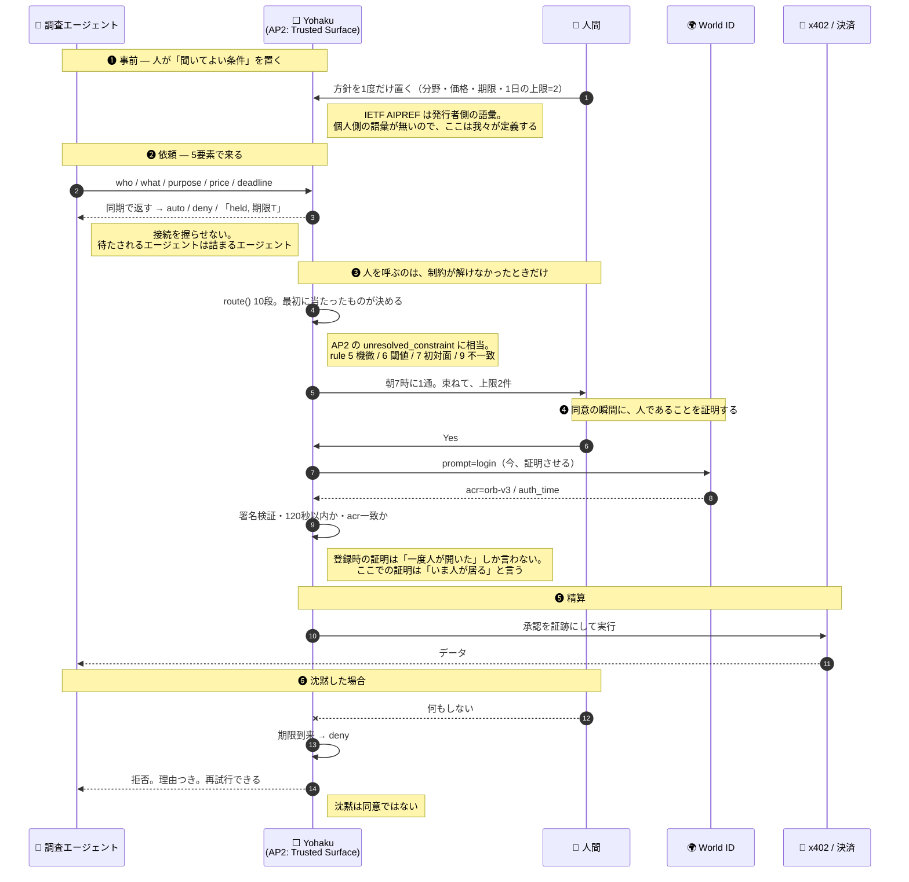

# 二人の顧客のジャーニー

**顧客は二人いる。払うのはエージェント、売るのは人間。**
どちらも「Yohaku を使いに来る」のではない。**別の用事の途中で、ここを通る。**

根拠は [../knowledge/AGENT-TO-HUMAN-PROTOCOLS.md](../knowledge/AGENT-TO-HUMAN-PROTOCOLS.md)
（AP2 / MCP / AIPREF / x402 / personhood credentials の一次情報）。ここはその上に立つ設計。

---

## 0. 二人が、それぞれどこに立っているか

| | **顧客A — AIエージェント** | **顧客B — 人間（人間証明済み）** |
|---|---|---|
| **誰か** | 買い手企業に雇われた調査エージェント。24時間動き、止まらない | 自分の生活を生きている人。副業でも事業でもない |
| **何しに来たか** | **来ていない。** 仕事の途中で「人間由来のデータが要る」に当たっただけ | **来ていない。** 寝ていた。朝、通知が1つある |
| **成功とは** | **止まらずに済むこと。** 待たされない、拒否の理由が分かる、再試行できる | **判断の回数が増えないこと。** 収入より先に、**疲れないこと** |
| **失敗とは** | 接続を握ったまま人の睡眠を待つ。理由なく落とされる | 朝に50件ある。**1回でもそうなったら二度と開かない** |
| **どのくらいの頻度** | 1日に何百件も、何十人に対して | **1日2件。** 上限は本人が決める |

**この非対称が製品の全部です。** エージェント側は**スループット**、人間側は**回数の少なさ**。
同じ1件が、片方には「1/500」で、もう片方には「2件のうちの1件」。

---

## 1. 規約の受け渡し — 誰から誰へ、何が渡るか

---

## 2. 顧客A（エージェント）のジャーニー

| 段 | どこに居るか | 何が起きてほしいか | Yohaku が返すもの | 外すとどうなるか |
|---|---|---|---|---|
| **気づく** | 「人間由来のデータが要る」に当たった。web を漁っても**人が書いたものか判別できない** | **人由来だと証明できる供給源**を見つけたい | ENS 名で引ける。方針の hash がチェーンにある | 見つからなければ、汚染された無料データで済ませる |
| **打診** | 何百件のうちの1件 | **即答。** 握らされない | **同期で** `auto` / `deny` / `held + 期限` | 接続を握ったまま人の朝を待つ = 詰まる |
| **待つ** | 他の仕事をしている | **いつ終わるか**が分かる | `deadline` を返す。それまでに必ず決着する | 無期限の pending は、エージェントにとって障害と同じ |
| **断られる** | | **理由。** 再試行していいのか、二度と無駄なのか | どの rule で落ちたかを返す | 理由の無い拒否は、同じ依頼を延々と再送させる |
| **通る** | | 精算して、データを受け取る | 承認の証跡つきで実行 | — |
| **次** | 同じ相手にまた聞く | **2回目以降は速くなってほしい** | 学習して `auto` に寄る（rule 7 は一度だけ） | 毎回人に聞かれるなら、相手として使えない |

**エージェントにとっての価値は「買えること」ではなく「詰まらないこと」。**
拒否も、期限も、理由も、**全部 ROI のうち**。

## 3. 顧客B（人間）のジャーニー

| 段 | どこに居るか | 何が起きてほしいか | Yohaku が返すもの | 外すとどうなるか |
|---|---|---|---|---|
| **入り口** | 「エージェントが金を払うらしい」と聞いた。**期待も不安もある** | **人間しか入れない場所**だと分かる | World ID で登録。**名前は剥奪されうる**と明示 | 誰でも入れるなら、買い手にとって価値が無い |
| **方針を置く** | ここだけは能動的。**1度だけ** | 難しくないこと。**上限を自分で決められること** | 分野・価格・期限・**1日2件**。既定値は全部 deny 寄り | ここが難しいと、二度と設定されず既定のまま |
| **寝る** | **何も起きない。これが商品** | 気づかないこと | 約50件が自動で処理される | 夜中に通知が鳴った時点で負け |
| **朝** ★ | 起きた直後。**まだ何も判断したくない** | **1通。中身がすぐ分かる** | 「今日きたオファー 23件。**あなたが要るのは1件**」 | 50件のリストを見せた瞬間、二度と開かない |
| **判断** ★ | 15秒くらいしか使わない | **Yes/No だけ。**理由が1行 | どの rule で来たかを1行。金額と残り時間 | 説明を読ませると、判断ではなく作業になる |
| **証明** | Yes を押した直後 | **一手で終わる** | その場で World ID。120秒以内でないと通らない | ここで手間取ると、承認そのものが嫌になる |
| **確認** | 押したあと | **何が起きたか。特に、お金が動いたのか** | 「**まだ支払われていません**。決済は未接続」と画面に書く | 曖昧にした瞬間、製品全体が信用を失う |
| **無視する** | 忙しい。答えない | **無視も答えとして成立してほしい** | 期限で deny。**保護される側に倒れる** | 未処理が溜まる = 借金と同じ |
| **1ヶ月後** | | **朝が静かになっていること** | 実測: 朝の件数は2週間変わらない。**先に増えるのは「聞かれずに済んだ数」**（0.1→6.3件/日） | 「すぐ楽になる」と言うと、2週目で裏切る |

**人間にとっての価値は収入ではなく、余白。** ★ の2箇所（朝・判断）で製品の全部が決まる。

---

## 4. 決定的な瞬間は2つしかない

| | なぜここなのか |
|---|---|
| **朝、通知を開いた最初の3秒** | 件数が2でなく50だったら、その人は二度と開かない。**上限は機能ではなく、生存条件** |
| **Yes を押した直後の1画面** | ここで「入金されました」と嘘を書けば、他の全部の主張が死ぬ。だから**「まだ支払われていません」と自分から書く** |

## 5. 規約の言葉で言うと、我々は何者か

**AP2 の Trusted Surface です。** 仕様はこの役割にだけ MUST を付けている
— *"The following role MUST be non-agentic: Trusted Surface"*。理由も書いてある
— *"the Agent itself is a potential attacker"*。

| 我々の設計 | 一致する要求 |
|---|---|
| `route()` は純粋関数。LLM は rule 9 にしか居ない | **non-agentic** |
| AI が返せる値に `pass` が無い | エージェントは攻撃者になりうる |
| 承認の瞬間に人であることを証明させる | informed consent を取ってから署名 |

**そして、どの規約も埋めていない穴が1つある。**
1件の同意を正しく取る規約は揃った（AP2）。**1日に何件まで人を呼んでよいかは、
まだ誰も定義していない。** それが `dailyCap` です。

## ⚠️ このジャーニーで確かめていないこと

- **人間側の入り口（登録と方針設定）を、実際に人に触らせていない。** 朝と判断の2画面しか作っていない
- 「約50件」は生成した夜であって、**実需要の測定ではない**（[ASSUMPTIONS.md](ASSUMPTIONS.md) A3/A4）
- エージェント側の ROI は**推測**。実際の買い手に当てて確かめていない
- AP2 の Mandate を**個人が売り手として**発行した実例を、我々は見ていない

**ブースで聞くのはこの4つ。** 「気に入ったか」ではなく「何を探しているか」を先に聞く。
