# Yohaku — 思想から、市場、ジャーニー、そして埋めるべき穴まで

> **絵と文の両方で書いてあります。** 図だけ追っても、文だけ読んでも通るように。
> 数字と引用には全部出典があります（[../knowledge/](../knowledge/)）。

**この文書の筋**

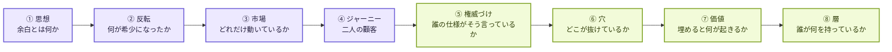

---

# ① 思想 — 余白は、余りではない

日本画に **余白** という言葉があります。**描き残しではなく、描かないと決めた場所です。**
画面のどこを空けるかで、何が見えるかが決まる。

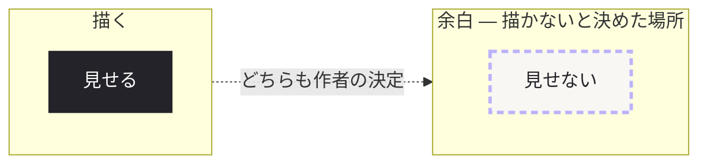

**エージェントは眠りません。** 放っておけば、人の1日は全部埋まります。
だから決めるべきは「何を見せるか」ではなく、**何を見せないか**です。

> **Yohaku は判断を作るのではなく、余白を作る。**
> 自動で通した依頼は余白を**生み**、拒否した依頼は余白を**守り**、
> 人に上げた依頼だけが余白を**使う**。

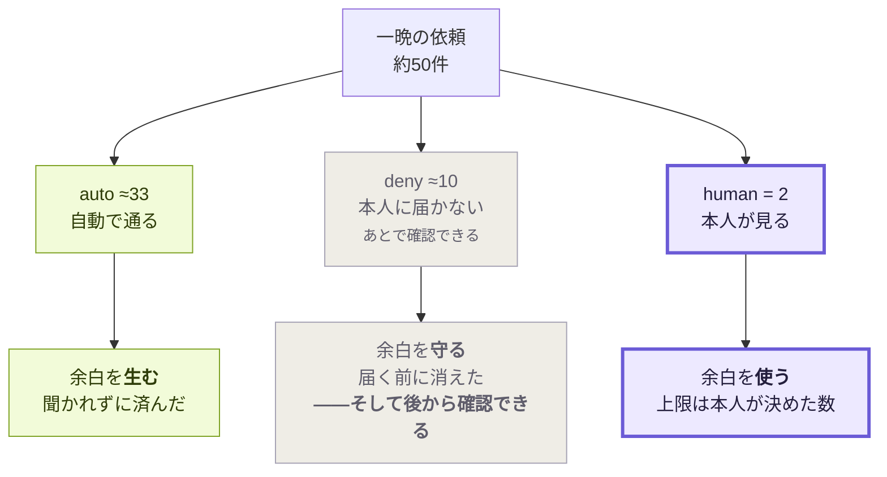

**興味深い数字は 50 ではなく 2 です。** いくつ来るかは我々が決められない。
**いくつ届くかは決められる。**

---

# ② 反転 — 高くなったのは計算ではなく、人

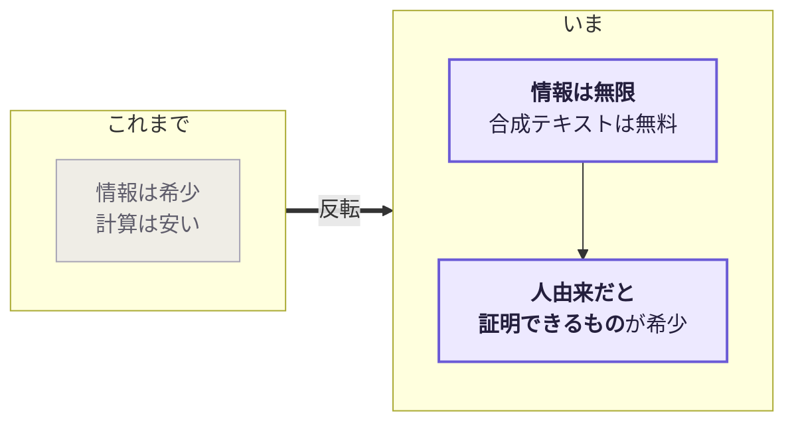

**エージェントは記録を抜きに来るのではありません。調査しに来ます。**
*「棚に戻した理由は？」「最初の5分で何が起きた？」「どこで見放した？」*
**モデルはどんな答えでも作れます。本当の答えだけが作れません。**

**論理は3行です。**

1. 学習コストに上限が無い。**高くなるのは計算ではなく、まだ誰も持っていないデータ**
2. **エージェントは web を漁っても「人が書いたもの」を判別できない。** 合成テキストは無料で、
   区別がつかない
3. だから **スクレイピングは無料で、かつ汚染されている**

> **エージェントは「生成物ではないと証明できるもの」になら払う。**

そこから製品の性質が1つだけ決まります。

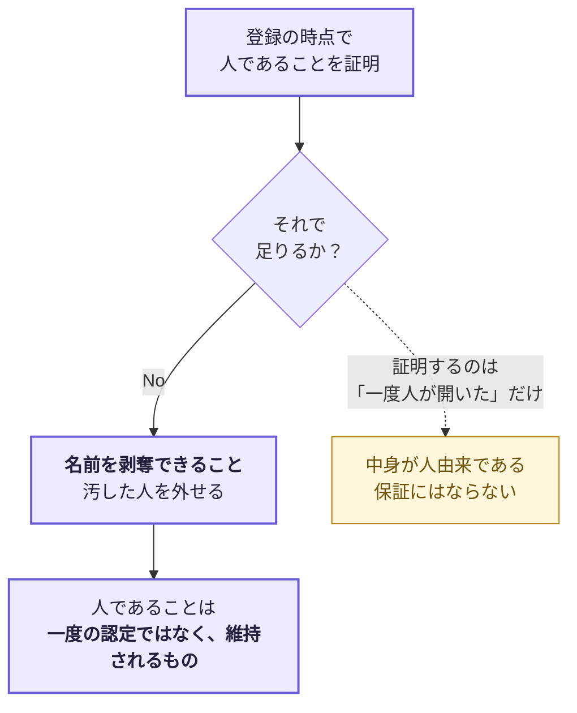

**この系譜は我々の思いつきではありません。** OpenAI・MIT・Microsoft・Harvard ら
**32名の論文** [*Personhood credentials*](https://arxiv.org/abs/2408.07892)（2024-08）が、
**個人情報を明かさずに実在の人間であることを示す資格情報**を提案しています。
成立の根拠は「**AI は最先端の暗号を破れず、現実世界で人として通れない**」こと。

---

# ③ 市場 — もう議論ではなく、動いている

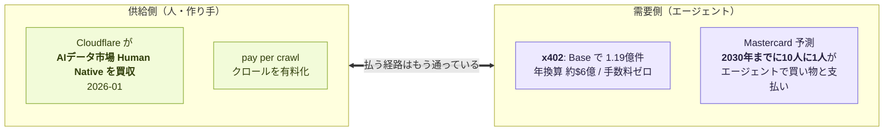

| 事実 | 出典 |
|---|---|
| **x402 が Linux Foundation で正式発足**（2026-04-02）。HTTP 402 + ステーブルコイン。**Base で1.19億件、Solana で3,500万件、年換算 約$6億、プロトコル手数料ゼロ** | [Coinbase + Cloudflare](https://www.coinbase.com/blog/coinbase-and-cloudflare-will-launch-x402-foundation) |
| **Cloudflare が AI データ市場 Human Native を買収**（2026-01-15）。インフラ事業者が「AI開発者は作り手に払うべきだ」側に張った | [CNBC](https://www.cnbc.com/2026/01/15/cloudflare-ai-human-native-acquisition.html) |
| **2030年までに10人に1人**がエージェントで日常的に買い物・支払い | [Mastercard](https://www.mastercard.com/news/europe/en/newsroom/press-releases/en/2026/mastercard-report-predicts-that-one-in-10-people-will-routinely-use-ai-agents-to-shop-and-pay-by-2030/) |
| 規制は追いつかず。**スペイン AEPD（2026-02）: 「エージェントの自律性は新しい法的カテゴリを作らない。導入した組織が全責任を負う」** | [解説](https://www.mtm.video/blog/ai-agents-data-privacy-gdpr-ai-act-compliance-guide-2026/) |

**最後の1行が効きます。** 責任が組織に残るなら、**同意の証跡を誰が持つか**が争点になる。

⚠️ **1人あたり約50件/日は、我々の生成した夜であって実需要の測定ではありません**
（[ASSUMPTIONS.md](ASSUMPTIONS.md) A3/A4）。**製品の主張は入力ではなく出力（2件）です。**

---

# ④ ジャーニー — 顧客は二人。どちらも「使いに来ない」

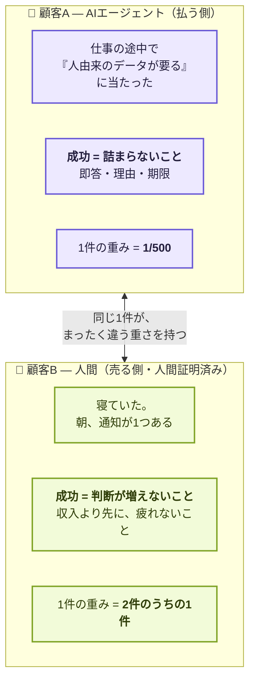

**この非対称が製品の全部です。** 片方はスループット、もう片方は回数の少なさ。

## プロセス図 — 一晩を横断する

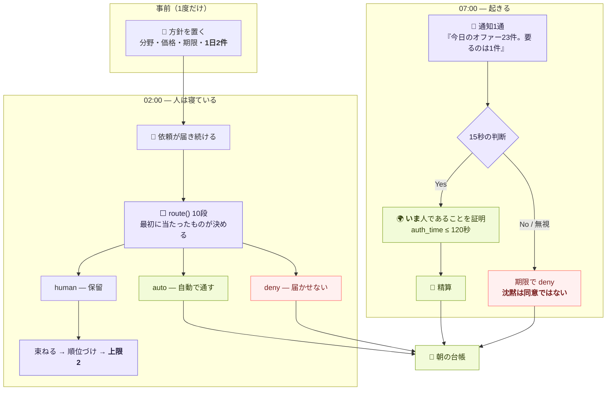

## 遷移図 — 1件の依頼が辿る状態

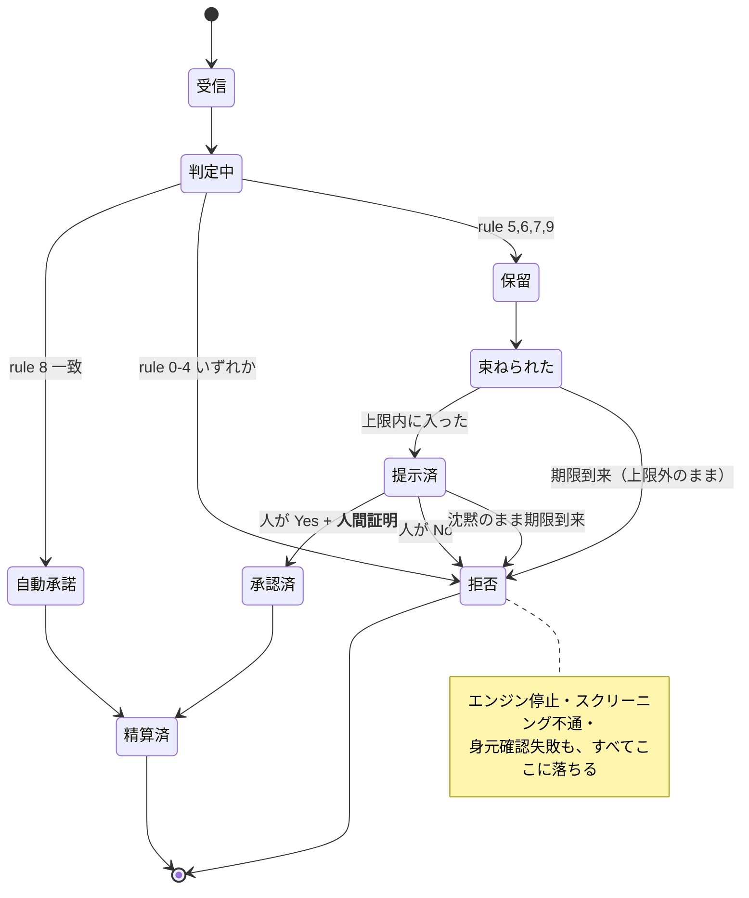

## 情報フロー — 各段で、何が渡るのか

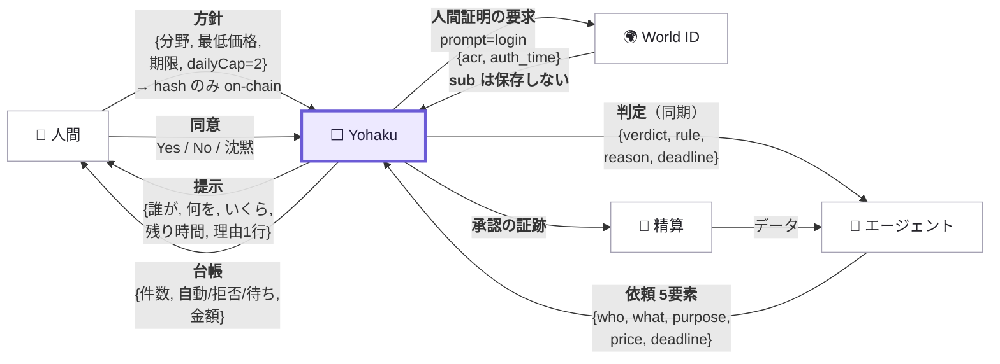

| 渡るもの | 中身 | 意図 |
|---|---|---|
| **方針** | 分野・最低価格・期限・**1日の上限** | 本文はオフチェーン、**hash だけ**チェーンへ |
| **依頼** | **who / what / purpose / price / deadline** の5つだけ | `deadline` が肝。**人が寝ている間に何が起きるか**を先に決める |
| **判定** | verdict / rule番号 / 理由 / 期限 | **同期で返す。**エージェントに接続を握らせない |
| **提示** | 誰が・何を・いくら・残り時間・理由1行 | 15秒で決まる量だけ |
| **人間証明** | `acr` と `auth_time`。**`sub` は保存しない** | 必要なのは「いま人が居た」ことだけ |
| **台帳** | 件数・内訳・金額（**未入金なら「worth」と表示**） | できないことを画面に書く |

---

# ⑤ 権威づけ — ジャーニーの各段は、誰かの仕様に載っている

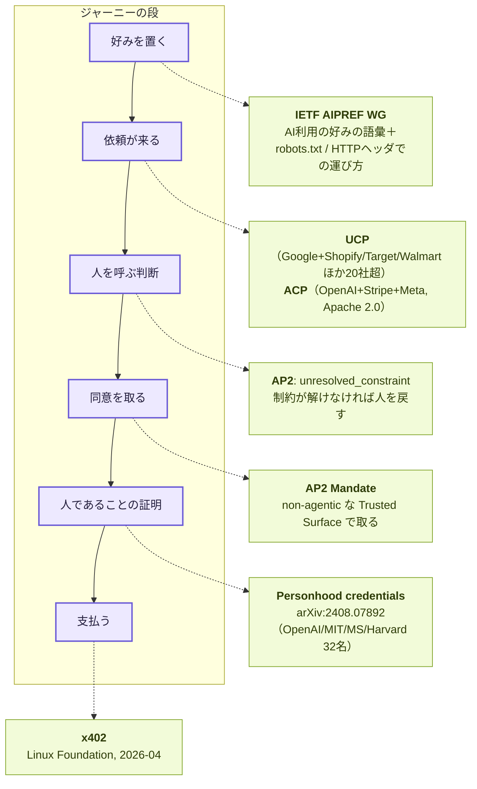

**特に効く引用が2つあります。**

### 「人を呼び戻す条件」には、もう名前がある

**AP2**（Google、2025-09-16、PayPal / Mastercard / Amex / Adyen / Coinbase など**60社以上**）:

> *"A Human Not Present flow can be turned into a Human Present flow by the Merchant
> (or Credential Provider) returning an **`unresolved_constraint`** error and bringing the
> User back into the loop to approve the closed Mandates."*

**人が呼ばれるのは「大事だから」ではなく、先に承認した制約の中で解けなかったから。**
我々の rule 5（機微）・6（閾値）・7（初対面）・9（不一致）は、全部これの具体例です。

### 「我々が座っている場所」にも名前がある

AP2 は5つの役割のうち、**1つにだけ MUST を付けています。**

> *"**Trusted Surface (TS):** a UI surface that is trusted to get informed user consent for an
> Intent before creating a user-signed Mandate."*
> *"The following role **MUST be non-agentic**: Trusted Surface"*
> 理由 — *"when either role is agentic, then **the Agent itself is a potential attacker**."*

| 我々が先に決めていたこと | 一致する要求 |
|---|---|
| `route()` は純粋関数。10段を順に評価し、**LLM は rule 9 にしか居ない** | **non-agentic** |
| AI が返せる値に **`pass` が存在しない**（スキーマに無い） | **エージェントは攻撃者になりうる** |
| 承認の瞬間に人であることを証明させる（`auth_time` 120秒） | **informed consent** を取ってから署名 |

**設計を変える必要はありませんでした。名前が付いただけです。**

---

# ⑤.5 窓口は増える。人が持つルータは1つ

**エージェントが顧客になれば、窓口は1つでは終わりません。** パネル会社も、求人板も、
調査の市場も、**エージェント用の入口を生やします。** そしてどれも A2A を喋ります
（自分を知らないエージェントが辿り着ける方法が、それしか無いため）。

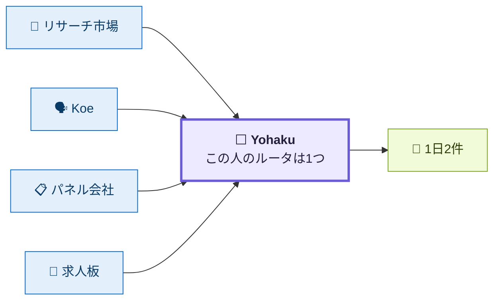

**人は、プラットフォームごとにアカウントと方針と通知を持てません。**
Agent Card は**サイトではなく本人に属する**ので、どこから見つけられても、依頼は同じ場所に届きます。

| | |
|---|---|
| **要らないもの** | 本人に届く前に処理される |
| **良いもの** | **見ていなかったプラットフォームに来たせいで逃す、ということが起きない** |
| **人が決めるべきもの**だけ | 濾されて、**すでに社会に実装されている財布**に届く |

> **窓口が何枚になっても、人が持つのは受信箱の束ではなく、ルータ1つです。**
> これが「機能」ではなく「層」である理由です。

# ⑥ 穴 — 全部の規約が、相手を「事業者」だと思っている

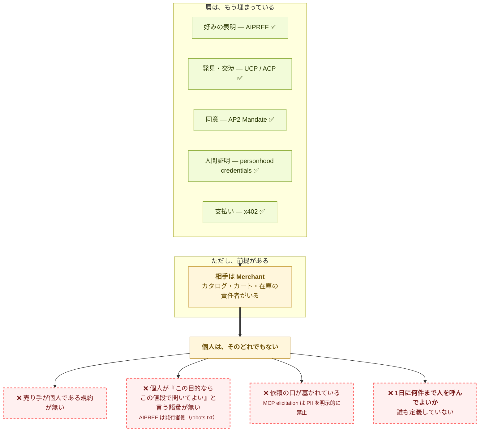

**「エージェントが人に聞く」唯一の既成の口が、我々のやることを名指しで禁止しています。**

**MCP elicitation**（サーバがツール実行を止めて人に問う仕組み）:

> *"Elicitation is **not** a vehicle for requesting personally identifiable information (PII),
> credentials, or any other sensitive data. Servers **MUST NOT** request such information
> through elicitation."*

**これは我々に不利な事実ではなく、別の同意の面が要ることの証明です。**

> **1件の同意を正しく取る規約は揃った。**
> **1日に何件まで人を呼んでよいかは、まだ誰のものでもない。**

---

# ⑦ 価値 — 埋めると何が起きるか

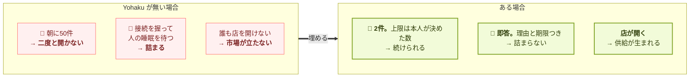

| 誰に | 何が起きるか | 測ったか |
|---|---|---|
| **人間** | 朝の件数が**上限で固定**される。20回の実行で**毎回2件** | ✅ `npm run verify` が再導出 |
| **人間** | 先に増えるのは収入ではなく**「聞かれずに済んだ数」**（0.1 → 6.3件/日）。朝が静かになるのは**4週目** | ✅ 30夜を再生して測定。**「1週間で12→5→2」は偽だったので撤回済み** |
| **エージェント** | 同期応答・理由つき拒否・期限。**握らされない** | ✅ HTTP とプロセス内の一致を test で固定 |
| **両方** | **委任先のAIが、自分の権限を書き換えられない** | ⚠️ 名前と resolver は**チェーンに乗った**。委任先が拒否される証拠だけ、これから |

> **Yohaku は「断る道具」ではありません。開けるようにする道具です。**
> エージェント経済で店を開けば一晩で約50件来る。**捌ける人だけが、その商売を取れる。**

---

# ⑧ 層 — 誰が何を持っているか

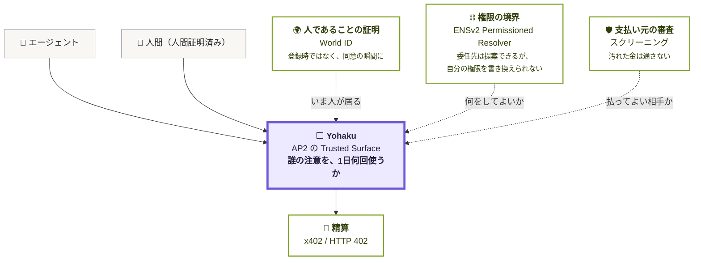

**身元も、権限も、審査も、精算も、すでに誰かが持っています。**
**持ち主がいないのは真ん中の1つだけです** — *エージェントの依頼と、人の注意の間*。

| 層 | 問い | 状態 |
|---|---|---|
| 人であることの証明 | **いま**人が居るか | ✅ 実機で往復済み |
| 権限の境界 | 委任先は何をしてよいか | ⚠️ 未確認4点は解決。チェーンはこれから |
| 支払い元の審査 | 払ってよい相手か | ✅ 形は動く |
| **注意の配分** | **今日、何回この人を呼んでよいか** | **⬜ ここが Yohaku** |
| 精算 | どう払うか | ✅ **実際に動いた。**[auto](https://sepolia.basescan.org/tx/0x79c1e3239ef89cdc1b8a5fc14321093b06504a3c68a24644ba6390caf90393fa) と [承認後](https://sepolia.basescan.org/tx/0x5c79fddfc8d6e6f64c1dd23752fae688a9b94ec5bc770f24fd1c2595b00d1d88) |

---

# ⑨ 役割分割 — 金と、責任を、どこで切るか

**エージェントが顧客になるのが当たり前になった時代に、人とエージェントの間で切り分けが要る
ものは2つあります。金と、責任です。**

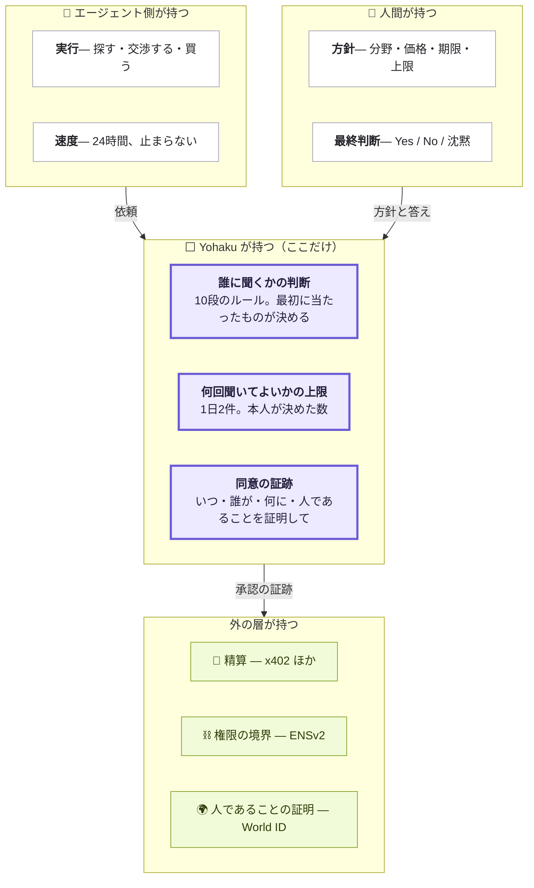

**金の分割は分かりやすい。** 誰がいくら払い、誰が受け取るか。x402 や AP2 が担います。

**責任の分割のほうが重い。** スペイン AEPD は 2026-02 にこう言いました。

> **「エージェントの自律性は新しい法的カテゴリを作らない。それは個人データ処理の技術的手段であり、
> 導入した組織が全責任を負う。」**

**つまり「AIが勝手にやった」は成立しません。** 責任は人間の側に残る。
であれば決定的なのは、**同意がいつ・誰から・何に対して取られたかの証跡を誰が持つか**です。

| 分割するもの | 誰が持つか | 根拠 |
|---|---|---|
| **お金** | 精算層（x402 / AP2 Payment Mandate） | 仕様がある |
| **権限** | チェーン（ENSv2）。**委任先は自分の権限を書き換えられない** | 仕様がある |
| **人であること** | 身元層（World ID / personhood credentials） | 仕様がある |
| **責任** | **導入した組織（＝人間の側）** | AEPD 2026-02 |
| **→ その責任を支える証跡** | **⬜ Yohaku** | **ここに持ち主がいない** |

# ⑩ なぜ OSS なのか — 善意ではなく、要件だから

**Yohaku は MIT です。** 「みんなで広げよう」という話ではありません。**開いていないと成立しない**
種類の製品だからです。

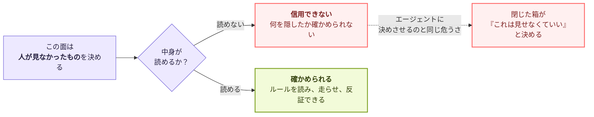

AP2 は Trusted Surface に **MUST be non-agentic** を課しました。理由は
*"the Agent itself is a potential attacker"*。**同じ理屈が一段先まで伸びます。**

> **人が「見なかったもの」を決める面は、中身が読めなければならない。**
> 見せないと決める側は、**見せられる側**でなければならない。

だから我々は、主張を主張のまま置きません。

```bash
npm test          # 409 tests
npm run verify    # 12 claims — ドキュメントの数字をコードから再導出する
npm run seed -- 2    # 一晩を生成して route() に通す。seed を変えれば入力は動く
```

**「入力は 46〜54 で揺れる。本人に届く数は、20回とも 2 だった」は主張ではなく出力です。**
**反証も同じコマンドでできます。** ルールを書き換えて、数字が変わるのを見てください。

## 持っていってほしいもの

**製品ではなく、形のほうを使ってください。**

| 持ち出せるもの | どこにある |
|---|---|
| **順序つき10段。最初に当たったものが決める** | `src/core/rules.ts` |
| **未知は `human` に送る。`auto` ではない**（rule 9） | 同上 |
| **全部の故障経路が `deny` に落ちる。沈黙は同意ではない** | 同上 + `src/ports/` |
| **AI の返せる値に「通す」を作らない。**スキーマに無ければ、騙されても通らない | `src/ports/classifier.ts` |
| **1日に何人が何回呼ばれてよいかの上限** | `src/core/queue.ts` |
| **主張をコードから再導出する検証器** | `scripts/verify.ts` |

**この6つは Yohaku のものではありません。** エージェントが人に何かを頼む場所なら、
どこでも要るものです。**合わないと思ったら、反証して教えてください。**
我々は実際に自分の主張を2つ撤回しています（[ASSUMPTIONS.md](ASSUMPTIONS.md) B3、§5）。

---

# 落ち

エージェントは眠りません。人は眠ります。

**一晩に約50件来て、彼女が見るのは2件。**
残り48件ぶんの静けさが、この製品が売っているものです。

> **余白は、余りではない。描かないと決めた場所です。**

そして、**何を描かないかを決める場所は、誰にでも読めなければならない。**
だから MIT で、だから検証器が付いています。

**取っていってください。反証してください。** 誰かの1日が2件で済むようになるなら、
それが Yohaku である必要はありません。

---

*図の一覧は [../README.md#7-図面の一覧](../README.md#7-図面の一覧)。
数字の根拠は [ASSUMPTIONS.md](ASSUMPTIONS.md)、外部の一次情報は [../knowledge/](../knowledge/)。*
